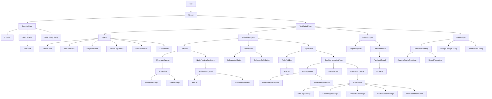
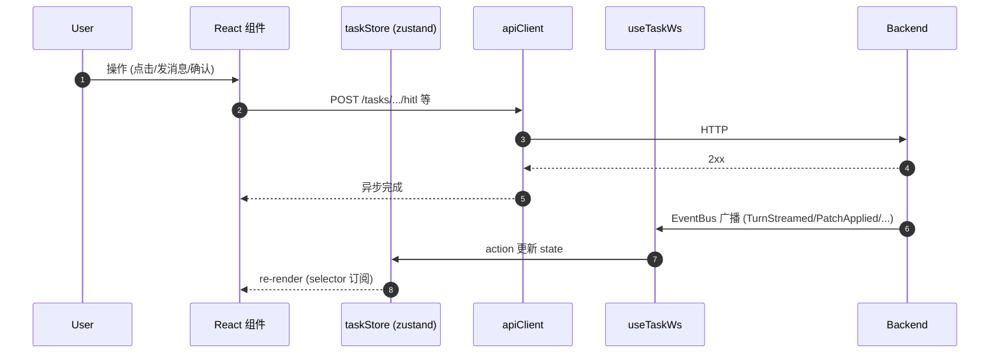

## 定位

- 需求/交互决策依据：`[基于trae-agent的思维导图需求拆解与sdd_tdd执行系统-一期全局角色极简版_a7e3b91c.plan.md](/Users/mima1-6/.cursor/plans/基于trae-agent的思维导图需求拆解与sdd_tdd执行系统-一期全局角色极简版_a7e3b91c.plan.md)` 6.4 / 7.5
- 组件骨架来源：`[实施_plan_函数组件清单_f4bc0d9b.plan.md](/Users/mima1-6/.cursor/plans/实施_plan_函数组件清单_f4bc0d9b.plan.md)` 第六节 F1-F13
- 测试场景来源：`[测试清单伴生_plan_db75900d.plan.md](/Users/mima1-6/.cursor/plans/测试清单伴生_plan_db75900d.plan.md)` 第四节

本 plan 把这三份信息按"界面→组件→测试"重新组织，并补齐缺失的布局/交互/阻塞态细节。

## 一、信息架构

### 1.1 路由

| 路径 | 页面 | 用途 |
|---|---|---|
| `/` | `TaskListPage` | 全部 Task 列表、新建入口 |
| `/tasks/:taskId` | `TaskDetailPage` | 单任务：思维导图 + 对话 + 审计 + Gate/改设计弹窗 |
| `/tasks/:taskId/turns/:turnId` | `TaskDetailPage` + turn 深链 | 深链定位某条 Turn（右栏审计面板滚动+高亮） |

> 一期单页应用，无登录页、无设置页、无多用户切换。

### 1.2 技术栈

- `react 18` + `typescript`
- `react-router-dom` 路由
- `zustand` 状态
- `reactflow` 思维导图
- `shadcn/ui` + `tailwindcss` 基础组件库（Dialog / Tabs / DropdownMenu / Popover）
- `react-markdown` + `rehype-highlight` 渲染 ARCH design_content
- `mock-service-worker` + `mock-socket` 测试
- 不装 heavy UI lib（不引 Ant Design / MUI）

## 二、页面布局

### 2.1 TaskListPage

```
┌────────────────────────────────────────────────────────────────┐
│ Orch                                          [ + 新建任务 ]    │ ← TopNav
├────────────────────────────────────────────────────────────────┤
│                                                                │
│  ┌──────────────┐  ┌──────────────┐  ┌──────────────┐         │
│  │ Title        │  │              │  │              │         │
│  │              │  │              │  │              │         │
│  │ [stage bar ] │  │              │  │              │         │  ← TaskCardList
│  │ 3 repos*     │  │              │  │              │         │
│  │ 2h ago       │  │              │  │              │         │
│  └──────────────┘  └──────────────┘  └──────────────┘         │
│                                                                │
│  空态: 大插画 + "还没有任务，新建一个开始"                    │
└────────────────────────────────────────────────────────────────┘
```

- 卡片字段：title / stage badge / repos 数（*运行期动态，Task 刚创建时为 0）/ 最后活跃时间 / workspace 路径（省略号截断）
- 状态过滤条（pending / running / done / failed / archived）在右上角
- 点击卡片 → 跳 `/tasks/:id`
- 点击"新建任务" → 弹 `TaskConfigDialog`

### 2.2 TaskConfigDialog（新建任务弹窗）

```
┌─ 新建任务 ──────────────────────────────────────────┐
│                                                       │
│ 标题 *                                                │
│ [______________________________________]              │
│                                                       │
│ 根需求 *                                              │
│ [多行文本域 8 行                        ]             │
│ 提示：在这里描述需要做什么、涉及哪些背景、            │
│       可能需要改动的仓库（自然语言即可）。            │
│       arch_designer 会在 ARCH 阶段按需声明仓库。      │
│                                                       │
│ 统一分支名 (可留空)                                   │
│ [______________________________________]              │
│ placeholder: "留空将使用 orch/<task_id_short>/<slug>" │
│                                                       │
│ PPE 泳道 (可选)                                        │
│ [______________________________________]              │
│ 提示：PPE 测试 / 接口联调用；非空时会注入到 agent     │
│       prompt 与 adapter 进程的 PPE_LANE 环境变量。    │
│                                                       │
│ 高级 ▼                                                 │
│ ├─ 每个角色的 adapter (一期仅 trae)                    │
│    req_decomposer:           [ trae ▼ ]               │
│    req_completeness_critic:  [ trae ▼ ]               │
│    arch_designer:            [ trae ▼ ]               │
│    arch_coverage_critic:     [ trae ▼ ]               │
│                                                       │
│                        [取消]  [创建并启动]           │
└───────────────────────────────────────────────────────┘
```

**说明**：
- **不再收集**仓库清单（由 `arch_designer` 运行期用 `add_repo` op 懒声明，见主 plan 4.4.2）
- **不再收集**对战轮数（固定常量 `DEFAULT_MAX_ROUNDS=5`；需要继续的用 Gate HITL 的 `continue_battle`）

### 2.3 TaskDetailPage 两栏主布局（左右可拖 + 双侧可折叠）

```
┌────────────────────────────────────────────────────────────────────────────┐
│ [←] Task:<title>  [StageIndicator]  [Repos(3)▾] [全部 Turn] [归档]         │ TopBar
├───────────────────────────────────────┬─┬──────────────────────────────────┤
│                                       │ │ ●req_decomposer ○req_critic      │
│                                       │ │ ○arch_designer  ○arch_critic [+] │ RolesTabBar
│                                       │ │ ─────────────────────────────────│
│   MindmapCanvas (reactflow, 只读)      │ │                                  │
│                                       │ │  与 arch_designer 的沟通          │
│   ┌────┐                              │ │  ┌────────────────────────────┐ │
│   │REQ │ ── ┬── ARCH ─┬── CODE ─┬──T │D│  │ [battle] arch_designer ↩…  │ │
│   └────┘    │         │         │    │i│  │ [CONVERGED] system            │ │
│             ├── ARCH ─┤         ├──T │v│  │ [user]     我 @ARCH-42 ...  │ │ RoleConversationPane
│                       └── CODE ─┘    │ │  │ [converse] arch_designer ↩…│ │
│                                      │ │  │  已自动应用 2 处变更 ▶       │ │
│  ╔═══ NodeFloatingCard ═══╗          │ │  │ [impl]     arch_designer ↩…│ │
│  ║ ARCH-42                 ║ ← 点节点│ │  └────────────────────────────┘ │
│  ║ description / hints     ║   浮出  │ │  筛选: ☑含 battle ☑含系统标记    │
│  ║ design_content (md)     ║   [📌钉] │ │  ────────────────────────────── │
│  ║ [引用到对话] [关闭]     ║          │ │  [输入框  @ 节点选择器]  [发送]  │
│  ╚═════════════════════════╝          │ │                                  │
│                                       │ │                                  │
│  [◀ 隐藏左栏]          [▶ 隐藏右栏]  │ │  (被隐藏时，变成 48px 窄条，     │
│  (分别在 divider 两侧)                │ │   竖排 tab 图标 + 展开按钮)      │
└───────────────────────────────────────┴─┴──────────────────────────────────┘

覆盖层：
  - NodeFloatingCard（左栏内部，定位 absolute，点节点时浮出，可钉住、可拖动、可多卡）
  - ReposPopover（TopBar 的 Repos chip 下拉小浮层）
  - TurnAuditModal（TopBar "全部 Turn" 按钮 → 全屏模态）
  - 阻塞弹窗层: GateReviewDialog / DesignChangeDialog / NodeFailedDialog
```

### 2.3.1 布局行为细节

**分割器（SplitPanelLayout）**：
- 左右可拖：鼠标按在 divider 上拖动，实时刷新两栏宽度；用户偏好（px 或百分比）持久化到 `localStorage`（key: `orch.splitRatio`）
- 最小宽度：左 320px、右 320px；拖到某侧小于最小宽度时自动"折叠"到 48px 窄条
- 折叠按钮：divider 内嵌两个箭头按钮 `[◀]` / `[▶]`；点一次完全折叠该侧到 48px
- 折叠态：被隐藏的栏变成 48px 竖向窄条，含展开按钮 + 一个角色/全局切换图标列（右栏折叠时窄条上有 4 个圆点代表 4 个角色，点某个直接展开并切到对应 tab）
- 都折叠是非法态，UI 硬阻止（最后一次展开按钮禁用）

**右栏 RolesTabBar**：
- 一期展示 4 个 tab：`req_decomposer` / `req_completeness_critic` / `arch_designer` / `arch_coverage_critic`，右侧预留 `[+]` 扩展位（二期加 `arch_executor` / `impl_coverage_critic` 直接加 tab，代码层用 `registeredRoles` 数组驱动，不硬编码 4）
- 每个 tab 标签含：角色名（简写：`REQ拆分` / `REQ校验` / `ARCH设计` / `ARCH校验`） + 状态小圆点
  - ● 蓝色：该角色有未读 Turn（自上次用户查看以来）
  - ◐ 流动蓝：正在 streaming 输出
  - ○ 灰：无新动静
  - ⚠ 黄：最近一轮有 `[VALIDATION_ERROR]` / `[NODE_FAILED]`
- 切 tab 不卸载其他 tab 的 state（保留滚动位置、输入草稿、筛选偏好）；用 `React.memo` + tab 组件 keep-alive 模式

**RoleConversationPane（每个 tab 的内容）**：
- 时间线气泡流，按 Turn 时间正序
- 每条 Turn 顶部有**来源徽标**：
  - `[user]` 红 — 人类发送的消息 Turn（`adapter_name="human"`）
  - `[battle]` 蓝 — DispatchLoop 驱动的 battle 轮（prod/critic 互评）
  - `[converse]` 紫 — 用户对话触发的 agent 响应
  - `[impl]` 绿 — CODE/TEST 实施期的 agent 调用
  - `[system]` 灰 — orchestrator 自己产的机读回传（VALIDATION_ERROR / 事件合成）
- 机读标记（`[CONVERGED]` / `[NODE_DONE]` / `[NODE_FAILED]` / `[DESIGN_CHANGE_REQUEST]` / `[VALIDATION_ERROR]`）从气泡正文里提取，作为单独一行小徽标显示
- 带 `<proposed_patch>` 的 Turn：正文下方显示 `AppliedPatchBadge`（"已自动应用 N 处变更 ▶"可展开看 summary）
- 筛选复选框（底部，默认全勾）：
  - `☑ 含 battle`：去勾后隐藏所有 `[battle]` 徽标的 Turn
  - `☑ 含系统标记`：去勾后隐藏所有 `[system]` 徽标的 Turn
- 筛选偏好 per-tab 独立持久化（`localStorage`：`orch.roleTabFilter.<role>`）

**输入框行为**：
- 当前 tab 的角色即为收件人，发送 = `POST /conversations { role: <tab 角色>, ... }`
- `@ 节点`：NodeReferencePicker 不变，picker 候选来源于整棵 mindmap 的节点集合
- 提交后进 `ConverseQueue`，tab 上状态小圆点变成 ◐ 表示排队 / streaming
- 阶段约束语义（一期不硬禁止，让 Orchestrator 自己排队）：
  - 任何阶段都能给任何角色发消息（比如 REQ battle 中给 arch_designer 发消息没意义，但前端不挡，后端会排队到后续阶段处理）
  - 前端给**不匹配当前阶段的 tab** 加灰底提示："当前阶段不是 REQ battle，消息会排队到 Gate 1 之后"

**NodeFloatingCard（点节点弹出的浮卡）**：
- 定位 `absolute` 在 mindmap 区域内，初始位置贴近被点节点右侧
- 内容：title + kind badge + description + hints 列表 + ARCH 节点的 design_content（md 渲染） + 状态徽标
- 按钮：`[📌 钉住]`（钉住后不会被下次点其他节点的新卡替换；未钉住的再点别处就消失）/ `[引用到对话]`（复制 `<<ref_N>>` chip 到当前 tab 输入框末尾）/ `[关闭]`
- 多节点钉卡可并存；可拖动（不离开 mindmap 容器）；按 Esc 关闭所有未钉住的卡

**ReposPopover（TopBar Repos chip）**：
- chip 显示 `Repos(N)` 当前仓库数；N=0 时显示 `Repos(0)` 灰态
- 点 chip 弹小浮层（宽 360px），列出每个 Repo：name / git_url（截断）/ base_branch / task_branch / init_commit_hash 前 7 位 / 本地路径 + [复制路径] 按钮
- WS `PatchApplied` 含 `added_repos` 时自动刷新
- 一期不支持从这里删除 Repo（`remove_repo` 留二期）

**TurnAuditModal（TopBar "全部 Turn" 按钮）**：
- 点按钮弹全屏模态（模态内 90% 视口）
- 内容即原来的 `TurnAuditPanel`：虚拟滚动列表 + 按 role / phase / 时间范围 / 关键字筛选
- 关闭 = Esc 或右上 X；关闭后回到主视图，状态不丢

### 2.4 弹窗层叠与阻塞优先级

当多个 blocker 并存时按此优先级显示（高优先级先处理，低优先级排队）：

1. **NodeFailedDialog**（CODE/TEST 失败的 halt）—— 不处理无法继续任何操作
2. **DesignChangeDialog**（agent `[DESIGN_CHANGE_REQUEST]`）—— 同上
3. **GateReviewDialog**（Gate1 / Gate2）—— 非紧急，但阻挡阶段推进

**同阶段允许的非阻塞操作**：
- 任何时候都能在右栏任意 tab 发对话消息（入队 `ConverseQueue`）
- 任何时候都能打开 `TurnAuditModal` 看全量审计
- 任何时候都能点节点看 `NodeFloatingCard`
- 任何时候都能点 `Repos` chip 看仓库列表

### 2.5 StageIndicator 状态条

```
●req_battle_running ─ ●gate1_waiting ─ ○arch_battle_running ─ ○gate2_waiting ─ ○executing ─ ○done
  current
```

- 阶段节点：灰（未到）/ 蓝（进行中）/ 绿（已通过）/ 红（失败）
- hover 某阶段 → 弹 tooltip："REQ 对战第 2/3 轮；最近活跃 30s 前"
- Gate 等待中时该点闪烁提示用户

## 三、组件树（全量）



**删除**（旧三栏布局的组件）：
- `MainContent`（旧 3-pane 容器）→ 替换为 `SplitPanelLayout`（左右两栏 + 拖动 divider）
- `ConversationPanel`（旧底部对话区容器）→ 拆成 `RolesTabBar` + `RoleConversationPane`
- `RoleSelector`（旧角色下拉） → 删除，角色选择改为 tab 切换
- `RightPanelTabs`（旧右栏三 tab 容器） → 删除，子内容按新方案重新分布
- `NodeInspector`（旧右栏的节点详情 tab） → 迁移到 `NodeFloatingCard`（内部 children 不变：HintList + MarkdownRenderer）
- `MessageHistory` → 改名 `RoleTurnTimeline`，气泡组件改名 `TurnBubble`（含 `TurnOriginBadge` + `MachineMarkerBadge`）

## 四、组件详细职责（扩展 F1-F13，补新增 9 个）

### F1. `apiClient` + `types`（已在实施 plan）

补充：封装 WS 事件 payload TypeScript 辨析联合。

**`createTask` 请求类型**（与后端 `CreateTaskRequest` 严格对齐）：

```ts
interface CreateTaskPayload {
  title: string;
  root_requirement: string;
  task_branch?: string;      // 留空由后端自动生成 orch/<id_short>/<slug>
  ppe_lane?: string;         // PPE 泳道，可空
  role_overrides?: Partial<Record<RoleName, { adapter: string }>>;
}
// 已删除：repos / repos_spec / max_design_rounds_* 字段
```

WS 事件联合新增 `RepoAddedEvent`（后端 `PatchAppliedEvent` 中若含 add_repo op，前端衍生一条 `RepoAddedEvent` 或直接消费 summary 里的 `added_repos`），详见 F21。

### F2. `taskStore` (zustand)

补充 state：`pendingNodeFailure: NodeFailureEvent | null`；blocker 按优先级计算的 `currentBlocker` 派生 selector。

### F3. `useTaskWs`（已列）

### F4. `TaskListPage`（已列）

补充：空态插图 + CTA；filter by status bar；按 updated_at 倒序。

### F5. `TaskConfigDialog`（已列）

**字段与职责**：
- `title`（必填）
- `root_requirement`（多行必填；说明文字引导用户在此写清背景/仓库线索，供 arch_designer 后续懒声明）
- `task_branch`（可空字符串；placeholder 动态显示"留空将使用 orch/<task_id_short>/<slug>"）
- `ppe_lane`（可空字符串；说明文字解释 PPE 注入路径）
- 高级分区：4 角色 adapter 下拉（一期只有 trae）
- 提交：调 `apiClient.createTask(payload: CreateTaskPayload)`；payload 不含 repos 相关字段、不含 max_rounds

**已删除**：
- ~~repos `useFieldArray` 子表单~~（仓库懒声明，见主 plan 4.4.2）
- ~~max_design_rounds_req/arch 两个数字输入框~~（走全局常量 5）

### F6. `TaskDetailPage`（两栏布局）

布局改用 `SplitPanelLayout` 作为主容器：
```
<TaskDetailPage>
  <TopBar />
  <SplitPanelLayout ratioKey="orch.splitRatio">
    <LeftPane>
      <MindmapCanvas />
      <NodeFloatingCardLayer />  {/* absolute 定位在 MindmapCanvas 内 */}
    </LeftPane>
    <SplitDivider />
    <RightPane>
      <RolesTabBar />
      <RoleConversationPane roleKey={activeRoleTab} />
    </RightPane>
  </SplitPanelLayout>
  <OverlayLayer>
    <ReposPopover />     {/* 由 TopBar 的 ReposChipButton 控制显示 */}
    <TurnAuditModal />   {/* 由 TopBar 的 FullAuditButton 控制显示 */}
  </OverlayLayer>
  <DialogLayer />        {/* 阻塞弹窗：Gate / DesignChange / NodeFailed */}
</TaskDetailPage>
```

### F6a. `SplitPanelLayout`（新增）

左右两栏 + 可拖 divider + 双侧可折叠。

- Props：`ratioKey` (localStorage key)、`minLeftPx`=320、`minRightPx`=320、`collapsedWidthPx`=48
- 内部 state：`ratio` (0-1 主栏占比)、`leftCollapsed`、`rightCollapsed`；全部持久化到 localStorage
- 渲染 `flex` 布局：`[leftPane | divider | rightPane]`，宽度按 ratio 计算
- 折叠态：被折叠侧渲染成 48px 窄条（含展开按钮 + 角色切换图标列给右栏、或导图 thumbnail 给左栏）
- 硬约束：不能两栏同时折叠（最后一个展开按钮 disabled）
- Divider：`role="separator"` + `aria-orientation="vertical"`；支持键盘（左右箭头微调 ratio）
- 拖动：`mousedown` → `document.body` 上挂 `mousemove`/`mouseup`；拖过程 `cursor: col-resize`

### F6b. `SplitDivider`（F6a 的子组件）

- 4px 宽的垂直条，hover 时变亮
- 居中叠两个圆形按钮：`[◀]`（折叠左栏） / `[▶]`（折叠右栏）
- 折叠态时替换成对应的展开按钮

### F7. `MindmapCanvas`（已列）

新增：
- **节点自动布局**由 `useMindmapLayout` 提供坐标；reactflow 禁掉 `nodesDraggable` + `elementsSelectable=true` + `zoomOnDoubleClick=false`
- 节点样式按 kind：REQ = 圆角矩形；ARCH = 菱形；CODE = 实线矩形；TEST = 虚线矩形
- Status badge 右上角小圆点：pending 灰 / running 黄 / done 绿 / failed 红 / design_pending 蓝
- 选中节点 → emit `onNodeClick(node, event)` 给 `NodeFloatingCardLayer` 在点击位置浮出卡片
- 连线类型：`parent_of` 实线；`has_code_child` / `has_test_child` 细实线不同色；`validates` 虚线

### F8. `NodeFloatingCard`（原 NodeInspector 迁移）

点节点后在 mindmap 区域浮出的卡片；原 `NodeInspector` 的内部渲染逻辑保留（HintList + MarkdownRenderer），只是容器变成浮卡。

- Props：`node`、`initialPosition: { x, y }`、`onClose`、`onPin`、`onReferenceInChat(nodeId)`
- 尺寸：360px 宽，最大高度 60vh（超出内部滚动）
- 顶部工具栏：title + kind badge + [📌 钉住 / 📍 取消钉住] [引用到对话] [关闭 X]
- 钉住后：卡片边框变色表示"已钉"；即使用户点其他节点也不会被替换
- 拖动：工具栏左侧有抓手区域，可在 mindmap 容器内拖动
- 点击 `[引用到对话]` → 调 `useRoleTabStore.appendChipToInput(activeRoleTab, { nodeId })`
- 内容：breadcrumb（`ROOT REQ › REQ-12 › ARCH-3`）+ description + hints 列表（按 weight must>should>nice 排序，category 图标化）+ ARCH 节点的 design_content（Markdown 分小节：概述 / 改动范围 / 下游调用契约 / 字段来历 / 测试规划）
- 多节点可同时钉多张卡

### F8a. `NodeFloatingCardLayer`（新增，承载多个 card）

- absolute 定位在 MindmapCanvas 上方
- 管理 `pinnedCards: NodeCardState[]`（多张钉住卡）+ `activeUnpinnedCard: NodeCardState | null`（一张未钉的临时卡）
- 接 mindmap 的 `onNodeClick`：未钉的卡存在时先关闭，再开新的；已钉卡不变
- Esc 键：关闭所有未钉卡

### F9. `RolesTabBar`（原 RoleSelector 替换）

4 个角色 tab 横排 + 右端 `[+]` 扩展位。

- Props：`roles: RoleName[]`（一期 `["req_decomposer", "req_completeness_critic", "arch_designer", "arch_coverage_critic"]`，二期可追加）、`activeRole`、`onChange`、`tabMeta: Record<RoleName, TabMeta>`
- `TabMeta`：`{ unreadCount: number, streaming: boolean, hasWarning: boolean, stageMatch: "match" | "queued" }`
- 每个 tab 按 `tabMeta` 渲染状态圆点（●◐○⚠ 见 §2.3.1）
- `stageMatch="queued"` 时 tab 加灰底 + tooltip "当前阶段不匹配，消息会排队"
- `[+]` 一期 disabled（二期开启）

### F9a. `RoleConversationPane`（原 ConversationPanel 主体）

每个 tab 对应的内容面板；切 tab 不卸载（`keep-alive` 模式保留滚动 / 草稿 / 筛选）。

- Props：`roleKey`、`taskId`
- 结构：
  ```
  <RoleConversationPane>
    <RoleTurnTimeline turns={filteredTurns} />
    <TurnFilterBar filter={localFilter} onChange={...} />
    <MessageInput role={roleKey} onSend={...} />
  </RoleConversationPane>
  ```
- `filteredTurns`：从 taskStore 取本角色的 Turns（以及 `adapter_name="human"` 且 `conversation_target_role=roleKey` 的用户消息），再按 `TurnFilterBar` 筛
- `MessageInput`：
  - `NodeReferencePicker` 输入 `@` 触发；候选来自整棵 mindmap；支持键盘上下选
  - `NodeReferenceChip` 已选渲染 chip（kind icon + short id），点 × 删除
  - 草稿 per-role 持久化到 localStorage（key: `orch.draft.<taskId>.<role>`）
  - 发送 = `POST /conversations { role: roleKey, message, referenced_node_ids }` → 进 `ConverseQueue`
  - 发送按钮下方显示 "当前排队中: N 条"（per-role 队列深度）

### F9b. `RoleTurnTimeline`（原 MessageHistory 改名）

Turn 气泡时间线；每条 `<TurnBubble>` 含 `TurnOriginBadge` + `MachineMarkerBadge` + `StreamingMessage` + `AppliedPatchBadge` + `ErrorFeedbackBubble`。

- 原 `MessageHistory` 的子组件（`StreamingMessage` / `AppliedPatchBadge` / `ErrorFeedbackBubble`）全部保留语义，只是归属改到 `TurnBubble` 下
- 新增 `TurnOriginBadge`：显示 `[user] / [battle] / [converse] / [impl] / [system]` 五种徽标（见 §2.3.1 定义 + 配色）
- 新增 `MachineMarkerBadge`：从 Turn.output_text 首行/尾行正则抽取 `[CONVERGED] / [NODE_DONE] / [NODE_FAILED] / [DESIGN_CHANGE_REQUEST] / [VALIDATION_ERROR]`，显示为单独小徽标

### F9c. `TurnFilterBar`（新增）

底部两个复选框：
- `☑ 含 battle`（默认勾）
- `☑ 含系统标记`（默认勾）

状态 per-role 持久化到 localStorage（key: `orch.roleTabFilter.<role>`）。

### F10. `GateReviewDialog`（已列）

补充：
- 顶部显示当前轮数和上限；"Continue Battle" 按钮右侧数字输入框选追加 N 轮（1-10 限制）
- 中部 tab 切换：最终论断 / 轮次轨迹
  - 最终论断 tab：左 proposer 最新完整回复 + 右 critic 最新完整回复（两栏）
  - 轮次轨迹 tab：时间轴，每轮一张折叠卡，展开看双方发言
- 底部 4 个按钮：Approve / Reject w/ Comment（必填）/ Approve Partial / Continue Battle
- 点 "Approve Partial" → 切到 **ApprovePartialTreeView**（全树复选树）：
  - 每个 Gate2 展示的 ARCH 节点及其子节点一行一行列出
  - 每行：kind icon + id + description 前 60 字 + [approve] [reject+comment] 单选
  - 底部提交按钮灰掉，直到所有节点都勾决议（不允许默认通过）

### F11. `DesignChangeDialog`（已列）

补充：
- 顶部标签："arch_designer 请求变更设计"
- 中部：agent 的自然语言说明（Markdown 渲染）
- 如果 agent 明确列出想做的 patch 预览（YAML），单独小节展示（但不给勾选）
- 底部：Approve（可选 comment）/ Reject（必填 comment）

### F12. `TurnAuditPanel`（已列）

补充：
- 每行显示：timestamp / role badge / phase badge / 前 80 字摘要 / artifacts 数字
- 点击展开：完整 content + consumed_artifacts + produced_artifacts + payload_extra (json viewer)
- 过滤器栏：role 多选 + phase 多选 + 时间范围 + 关键词搜索
- 虚拟滚动（`react-virtuoso`）支持 1000+ 行流畅

### F13. `useMindmapLayout`（已列）

补充算法：
- 分层：REQ 按深度列成左侧竖列；ARCH 在 REQ 右侧；CODE/TEST 在 ARCH 右侧按 kind 分上下两排
- 兄弟节点上下等距分布，动态高度估算避免重叠
- 节点增删时：保留已存在节点坐标，新节点插入在兄弟中位

### 新增 F14-F27

- **F14. `TopNav`**：logo + 新建按钮 + 未来二期预留设置入口
- **F15. `TaskCard`**：卡片布局；mini StageIndicator；悬停升 elevation
- **F16. `StageIndicator`**：通用阶段条，可独立测试
- ~~**F17. `RoleSelector`**~~ **已删除**（角色选择改为 `RolesTabBar` 的 tab 切换，见 F9）
- **F18. `NodeReferencePicker`**：@ 触发的候选浮层，键盘导航
- **F19. `NodeReferenceChip`**：chip 组件，支持 tooltip 预览节点内容
- **F20. `AppliedPatchBadge`**：可展开折叠按钮
- **F21. `ReposPopover`**（原 `RepoListView`，从右栏 tab 迁移到 TopBar 弹层）
  - 挂在 TopBar 的 `ReposChipButton` 下方；chip 显示当前仓库数 `Repos(N)`
  - 点 chip 弹 popover（宽 360px，shadcn `Popover`）；点外部或按 Esc 关闭
  - **初始态**：`N=0` 时 popover 内容是空态文案"尚未声明任何仓库；`arch_designer` 将在 ARCH 阶段按需声明"
  - **运行期追加**：订阅 WS `PatchAppliedEvent`，`summary.added_repos` 非空 → chip 数字 +1 + popover 列表追加
  - **每行字段**：name / git_url（截断省略）/ base_branch / task_branch / init_commit_hash（短 7 位）/ 本地路径 + "复制路径"按钮
  - 一期无"删除"按钮（`remove_repo` 留二期）
- **F22. `NodeFailedDialog`**（主 plan 6.3.1 缺前端组件）：节点失败 halt 弹窗，三按钮：re-dispatch / skip / 打回 arch_designer
- **F23. `TurnAuditModal`**（新增，封装原 `TurnAuditPanel` 为全屏模态）
  - 由 TopBar 的 `FullAuditButton` 触发显示
  - 全屏模态，90vw × 85vh；背景遮罩（rgba 黑色 40%）
  - 内部 `<TurnAuditPanel />`（原组件不动，只是容器改为模态）
  - 关闭：右上 X 按钮 / Esc / 点遮罩外部
  - 打开时记录来源 `returnFocusTo`（关闭后焦点回到 FullAuditButton，无障碍）
  - 关闭不丢 `TurnAuditPanel` 内部状态（filter / search / 展开行）——state 挂在父 `TaskDetailPage` 的 store 里，模态卸载只是隐藏 UI
- **F24. `TurnOriginBadge`**（新增）：小徽标 `[user] / [battle] / [converse] / [impl] / [system]`，按来源上色
- **F25. `MachineMarkerBadge`**（新增）：从 Turn 文本抽取 `[CONVERGED] / [NODE_DONE] / [NODE_FAILED] / [DESIGN_CHANGE_REQUEST] / [VALIDATION_ERROR]` 的单独显示徽标
- **F26. `ReposChipButton`**（新增，TopBar 子组件）：显示 `Repos(N)` chip，点击弹 `ReposPopover`
- **F27. `FullAuditButton`**（新增，TopBar 子组件）：显示 "全部 Turn" 文字按钮，点击打开 `TurnAuditModal`

## 五、数据流



- 唯一真理源：backend；UI 不做乐观更新（除了输入框本地态），全靠 WS 事件驱动
- 路径：HTTP 只负责"下达指令"；UI 展示靠 WS 事件回灌

## 六、设计风格

- 中文 UI 为主（开发者工具定位，但仍中文，因为需求描述/对话是中文）
- 字号梯度：xs 12 / sm 14 / base 15 / lg 18 / xl 22
- 色板：遵循 shadcn 默认；状态色：pending #9CA3AF / running #F59E0B / done #10B981 / failed #EF4444 / design_pending #3B82F6
- dark mode 一期支持（shadcn 开箱）
- 图标：lucide-react
- 无 toast 滥用；错误统一弹 Dialog，成功用右上角 snackbar 3s 自动消失

## 七、组件测试 case 清单（完整）

### T-F1. apiClient

- `client_createTask_calls_POST_tasks`
- `client_createTask_returns_typed_task`
- `client_getTask_includes_nodes_edges_turns`
- `client_postHitl_action_variants`（四种 action 各一条）
- `client_postConversation_with_refs`
- `client_postDesignChange_approve_reject`
- `client_listAdapters_returns_phase1`
- `client_4xx_throws_typed_error`
- `client_5xx_throws_typed_error`
- `client_ws_url_constructed_correctly`
- `client_ws_event_type_narrowing_correct`

### T-F2. taskStore

- `store_hydrate_replaces_state`
- `store_hydrate_preserves_ui_locals`（如折叠态）
- `store_apply_patch_summary_add_node`
- `store_apply_patch_summary_modify_node`
- `store_apply_patch_summary_delete_node`
- `store_append_turn_preserves_chronological`
- `store_append_turn_dedup_by_id`
- `store_set_gate_waiting_blocks_stage_advance`
- `store_set_design_change_blocks`
- `store_set_node_failure_blocks`
- `store_current_blocker_priority_order`（NodeFailure > DesignChange > Gate）
- `store_clear_blocker_respects_type`
- `store_reset_on_task_switch`

### T-F3. useTaskWs

- `useTaskWs_connects_on_mount`
- `useTaskWs_disconnects_on_unmount`
- `useTaskWs_dispatches_TurnStreamed_to_appendTurn`
- `useTaskWs_dispatches_PatchApplied_to_store`
- `useTaskWs_dispatches_GateWaiting`
- `useTaskWs_dispatches_DesignChangeRequest`
- `useTaskWs_dispatches_NodeFailed`
- `useTaskWs_auto_reconnect_after_drop`
- `useTaskWs_task_switch_closes_old_conn`

### T-F4. TaskListPage

- `TaskListPage_fetches_on_mount`
- `TaskListPage_renders_cards`
- `TaskListPage_empty_state_shown_when_no_tasks`
- `TaskListPage_card_click_navigates`
- `TaskListPage_new_task_button_opens_dialog`
- `TaskListPage_status_filter_narrows_list`
- `TaskListPage_sorts_by_updated_desc`
- `TaskListPage_error_state_render`（API 500）

### T-F5. TaskConfigDialog

**保留**：
- `TCD_required_fields_missing_blocks_submit`（title + root_requirement 必填）
- `TCD_adapter_dropdown_phase1_only_trae`
- `TCD_submit_calls_apiClient_createTask`
- `TCD_submit_closes_on_success`
- `TCD_submit_shows_error_on_failure`

**新增**：
- `TCD_task_branch_optional_shows_autogen_placeholder`：输入框 placeholder 含"留空将使用 orch/..."
- `TCD_task_branch_explicit_value_in_payload`：用户填 `feat/foo` → payload.task_branch === "feat/foo"
- `TCD_task_branch_empty_omitted_from_payload`：留空时 payload 不含 task_branch 键（或为 undefined）
- `TCD_ppe_lane_optional_free_text`：可填可空
- `TCD_ppe_lane_omitted_when_empty`
- `TCD_submit_payload_shape_matches_new_api`：payload 只含 { title, root_requirement, task_branch?, ppe_lane?, role_overrides? }
- `TCD_no_repos_subform_rendered`：DOM 中找不到"添加仓库"按钮和 git_url/base_branch 输入（反向断言）
- `TCD_no_max_rounds_inputs_rendered`：DOM 中找不到 max_rounds 相关输入（反向断言）

**删除**：
- ~~`TCD_at_least_one_repo_required`~~
- ~~`TCD_add_repo_row` / `TCD_remove_repo_row` / `TCD_last_repo_cannot_be_removed`~~
- ~~`TCD_task_branch_default_from_title_slug`~~（默认生成挪到后端 TaskRegistry）
- ~~`TCD_max_rounds_numeric_validation`~~
- `TCD_cancel_does_not_call_api`

### T-F6. TaskDetailPage（两栏布局）

- `TDP_fetches_task_on_mount`
- `TDP_split_panel_mounts_left_right`：DOM 存在 LeftPane + SplitDivider + RightPane 三个区域
- `TDP_mindmap_in_left_and_roles_tabs_in_right`
- `TDP_ws_connects_and_updates_ui_on_event`
- `TDP_topbar_back_navigates_list`
- `TDP_topbar_archive_calls_api_and_navigates_away`
- `TDP_topbar_has_repos_chip_and_full_audit_button`
- `TDP_no_bottom_convo_panel_in_dom`（反向断言：旧布局的 ConversationPanel / RightPanelTabs 容器不再出现）

### T-F6a. SplitPanelLayout

- `SPL_initial_ratio_from_localstorage_or_default_50_50`
- `SPL_mousedrag_on_divider_updates_ratio`
- `SPL_ratio_persisted_on_mouseup`
- `SPL_min_width_enforced_left_320px`
- `SPL_min_width_enforced_right_320px`
- `SPL_collapse_left_button_collapses_to_48px`
- `SPL_collapse_right_button_collapses_to_48px`
- `SPL_collapsed_side_shows_expand_button`
- `SPL_collapsed_right_shows_role_icon_rail`：折叠右栏时窄条显示 4 个角色图标列，点某个直接展开并切到该 tab
- `SPL_cannot_collapse_both_sides`：两栏都折叠时 UI 硬阻止（最后一个展开按钮 disabled）
- `SPL_keyboard_arrow_adjust_ratio`（无障碍）
- `SPL_aria_separator_role_present`

### T-F7. MindmapCanvas

- `MMC_renders_all_nodes`
- `MMC_kind_shapes_correct`（4 kind 各截断）
- `MMC_status_badge_colors_correct`（5 状态）
- `MMC_readonly_nodesDraggable_false`
- `MMC_readonly_no_delete_on_keyboard`
- `MMC_readonly_no_add_on_pane_click`
- `MMC_pan_zoom_still_allowed`
- `MMC_onSelect_fires_with_full_node`
- `MMC_edge_styles_by_kind`
- `MMC_handles_1000_nodes_without_freeze`（性能基线）
- `MMC_snapshot_fixed_fixture_golden`

### T-F8. NodeFloatingCard（原 NodeInspector 迁移）

- `NFC_does_not_render_when_no_node_clicked`
- `NFC_renders_on_node_click_positioned_near_node`
- `NFC_req_basic_rendering`
- `NFC_arch_markdown_rendering`
- `NFC_arch_test_plan_section_highlighted`
- `NFC_code_test_hints_sorted_by_weight`
- `NFC_hint_category_icons`
- `NFC_breadcrumb_correct_up_to_root`
- `NFC_markdown_xss_escaped`
- `NFC_long_description_scrolls_internally`
- `NFC_close_button_removes_card`
- `NFC_pin_button_toggles_pinned_state`
- `NFC_pinned_card_not_replaced_on_other_node_click`
- `NFC_unpinned_card_replaced_on_other_node_click`
- `NFC_multiple_pinned_cards_coexist`
- `NFC_reference_in_chat_button_appends_chip_to_active_role_tab_input`
- `NFC_drag_within_mindmap_container_only`
- `NFC_esc_closes_all_unpinned_cards`

### T-F9. RolesTabBar

- `RTB_renders_4_role_tabs_phase1`
- `RTB_expansion_slot_disabled_phase1`：[+] 在一期 disabled
- `RTB_active_tab_highlighted`
- `RTB_click_tab_calls_onChange`
- `RTB_unread_dot_shown_when_new_turn_arrives`
- `RTB_streaming_dot_animated_when_role_streaming`
- `RTB_warning_badge_on_validation_error`
- `RTB_queued_tab_shows_greyed_background_with_tooltip`
- `RTB_does_not_unmount_inactive_tabs`（keep-alive：切回时滚动位置、输入草稿保留）

### T-F9a. RoleConversationPane

- `RCP_filters_turns_by_role`：只渲染当前角色相关的 Turn + 对该角色的 user message
- `RCP_preserves_scroll_position_on_tab_switch`
- `RCP_preserves_input_draft_per_role`：在 req_decomposer tab 打一半草稿 → 切到 arch_designer → 切回 req_decomposer，草稿还在
- `RCP_draft_persisted_to_localstorage`
- `RCP_input_at_triggers_picker`
- `RCP_input_at_picker_keyboard_nav`
- `RCP_input_at_selects_inserts_chip`
- `RCP_chip_x_removes`
- `RCP_send_posts_to_correct_role_endpoint`：payload.role === 当前 tab 角色
- `RCP_send_clears_input_on_success`
- `RCP_queue_depth_per_role_displayed`
- `RCP_no_patch_checkbox_ui_absent`（反向断言）

### T-F9b. RoleTurnTimeline（原 MessageHistory 改名后）

- `RTT_bubbles_chrono_order`
- `RTT_streaming_message_token_incremental`
- `RTT_applied_patch_badge_shows_count`
- `RTT_applied_patch_badge_expand_lists_ops`
- `RTT_error_feedback_bubble_orange`
- `RTT_turn_origin_badge_user_red`
- `RTT_turn_origin_badge_battle_blue`
- `RTT_turn_origin_badge_converse_purple`
- `RTT_turn_origin_badge_impl_green`
- `RTT_turn_origin_badge_system_grey`
- `RTT_machine_marker_converged_extracted`
- `RTT_machine_marker_node_done_extracted`
- `RTT_machine_marker_validation_error_extracted`

### T-F9c. TurnFilterBar

- `TFB_default_all_filters_checked`
- `TFB_uncheck_battle_hides_battle_turns`
- `TFB_uncheck_system_hides_system_turns`
- `TFB_filter_persisted_per_role`：req_decomposer 关 battle → 切走 → 切回，复选框状态还原

### T-F10. GateReviewDialog

- `GD_shows_round_count_and_limit`
- `GD_final_verdict_tab_two_columns`
- `GD_round_trace_tab_expandable_cards`
- `GD_approve_button_submits`
- `GD_reject_requires_comment_nonempty`
- `GD_continue_battle_number_input_range_1_to_10`
- `GD_approve_partial_opens_tree_view`
- `GD_approve_partial_submit_disabled_until_full_coverage`
- `GD_approve_partial_submit_payload_shape`
- `GD_closed_after_submit`
- `GD_cannot_dismiss_by_backdrop_click`（强制决策，避免误关）

### T-F11. DesignChangeDialog

- `DCD_shows_agent_rationale_markdown`
- `DCD_patch_preview_displayed_readonly`
- `DCD_approve_submits_with_optional_comment`
- `DCD_reject_requires_comment`
- `DCD_closed_and_blocker_cleared`
- `DCD_cannot_dismiss_by_backdrop`

### T-F12. TurnAuditPanel（内容面板，放在 TurnAuditModal 里）

- `TAP_lists_turns_reverse_chrono`
- `TAP_filter_by_role_multi`
- `TAP_filter_by_phase_multi`
- `TAP_keyword_search_in_content`
- `TAP_time_range_filter`
- `TAP_expand_shows_artifacts_and_payload`
- `TAP_virtualized_1000_rows`
- `TAP_deep_link_scrolls_and_highlights`
- `TAP_json_viewer_renders_payload_extra`

### T-F23. TurnAuditModal

- `TAM_hidden_by_default`
- `TAM_opens_on_full_audit_button_click`
- `TAM_contains_turn_audit_panel`
- `TAM_closes_on_escape`
- `TAM_closes_on_backdrop_click`
- `TAM_closes_on_x_button`
- `TAM_focus_returns_to_full_audit_button_on_close`（无障碍）
- `TAM_state_preserved_across_open_close`：filter / search 状态不因关闭模态而丢

### T-F13. useMindmapLayout

- `UML_single_req_centered`
- `UML_deep_tree_layered_correctly`
- `UML_siblings_evenly_spaced`
- `UML_insert_node_only_reflows_siblings`
- `UML_delete_node_keeps_others_stable`
- `UML_arch_child_ordering_code_above_test`
- `UML_avoid_overlap`
- `UML_cyclic_input_rejected`

### T-F14-F22（新增组件的测试）

**F14. TopNav**：logo 渲染 + 新建按钮 emit

**F15. TaskCard**：
- `TC_renders_title_repos_count_activity`：显示 title、repos 数（0 也要显示"0 repos"而非隐藏）、最后活跃
- `TC_repos_count_zero_when_no_add_repo_yet`：新建 Task 立刻渲染时 repos 数为 0
- `TC_mini_stage_indicator`
- `TC_click_calls_onClick`
- `TC_hover_elevation`

**F16. StageIndicator**：
- `SI_renders_all_stages`
- `SI_current_stage_highlighted`
- `SI_hover_tooltip_shows_round_info`
- `SI_gate_waiting_pulsing`
- `SI_failure_stage_red`

**F17. RoleSelector（已删除，见 F9 RolesTabBar）**

~~原测试 `RS_*` 全部删除；角色选择职责转移到 `RolesTabBar`，测试见 T-F9.~~

**F18. NodeReferencePicker**：
- `NRP_opens_on_at`
- `NRP_filters_by_typing`
- `NRP_keyboard_up_down_navigates`
- `NRP_enter_selects`
- `NRP_escape_closes`
- `NRP_shows_kind_icon_and_id_and_desc`

**F19. NodeReferenceChip**：
- `NRC_renders_icon_id`
- `NRC_tooltip_on_hover_shows_description`
- `NRC_x_removes`

**F20. AppliedPatchBadge**：
- `APB_renders_count`
- `APB_click_expands_ops_list`
- `APB_ops_list_grouped_by_kind`

**F21. ReposPopover**（原 RepoListView，改为 TopBar chip popover）：
- `RP_chip_shows_repo_count_zero_initially`
- `RP_chip_count_increments_on_patch_applied_add_repo`
- `RP_popover_hidden_by_default`
- `RP_popover_opens_on_chip_click`
- `RP_popover_closes_on_esc`
- `RP_popover_closes_on_outside_click`
- `RP_empty_state_text_when_no_repos`：popover 内显示"尚未声明任何仓库..."
- `RP_lists_repos_after_hydration`：GET /tasks/{id} 返回含 repos → popover 列表渲染每行
- `RP_appends_row_on_ws_patch_applied_with_add_repo`
- `RP_does_not_change_on_unrelated_patches`
- `RP_copy_path_button_copies_to_clipboard`
- `RP_init_commit_hash_truncated_to_7`
- `RP_no_remove_button_phase1`（反向断言，`remove_repo` 留二期）
- `RP_links_to_git_url`

**F24. TurnOriginBadge**：
- `TOB_renders_user_red`
- `TOB_renders_battle_blue`
- `TOB_renders_converse_purple`
- `TOB_renders_impl_green`
- `TOB_renders_system_grey`

**F25. MachineMarkerBadge**：
- `MMB_extracts_converged_from_text`
- `MMB_extracts_node_done`
- `MMB_extracts_node_failed_with_reason`
- `MMB_extracts_validation_error`
- `MMB_extracts_design_change_request`
- `MMB_no_badge_when_no_marker`

**F26. ReposChipButton**：
- `RCB_renders_count_badge`
- `RCB_click_toggles_popover`

**F27. FullAuditButton**：
- `FAB_click_opens_turn_audit_modal`

**F22. NodeFailedDialog**：
- `NFD_shows_failure_content`
- `NFD_redispatch_button_calls_api`
- `NFD_skip_button_with_comment`
- `NFD_send_back_to_designer_button`
- `NFD_cannot_backdrop_dismiss`
- `NFD_blocker_cleared_on_decision`

### 前端 Playwright E2E（≥ 4 条）

- `e2e_task_creation_flow.spec.ts`：列表 → 新建（仅 title + root_req）→ 进入详情页 → 两栏布局存在
- `e2e_conversation_auto_patch.spec.ts`：切到 arch_designer tab → 发对话 → 看到 AppliedPatchBadge 在气泡下方
- `e2e_gate_approve_advances_stage.spec.ts`：gate1 弹窗 → approve → StageIndicator 推进
- `e2e_split_panel_and_overlays.spec.ts`：拖动 divider、折叠两侧、点节点浮出卡并钉住、TopBar 弹 ReposPopover、TopBar 打开 TurnAuditModal → 关闭 → 主视图状态不丢

## 八、开发顺序（与实施 plan W6-W9 对齐）

1. **W6a**：F1 apiClient + F2 taskStore + F3 useTaskWs + F14 TopNav + F4 TaskListPage + F15 TaskCard + F16 StageIndicator + F5 TaskConfigDialog
2. **W6b**：F6 TaskDetailPage 骨架 + **F6a SplitPanelLayout** + F6b SplitDivider（空子区域占位）
3. **W7**：F7 MindmapCanvas + F13 useMindmapLayout + **F8 NodeFloatingCard + F8a NodeFloatingCardLayer** + **F26 ReposChipButton + F21 ReposPopover**
4. **W8a**：F18 NodeReferencePicker + F19 NodeReferenceChip + F20 AppliedPatchBadge + **F24 TurnOriginBadge + F25 MachineMarkerBadge** + **F9 RolesTabBar + F9a RoleConversationPane + F9b RoleTurnTimeline + F9c TurnFilterBar**
5. **W8b**：F10 GateReviewDialog + F11 DesignChangeDialog + F22 NodeFailedDialog + F12 TurnAuditPanel + **F27 FullAuditButton + F23 TurnAuditModal**
6. **W9**：4 条 Playwright E2E 串联 + 打磨

每个组件开发前：写测试（RED）→ 实现（GREEN）→ Storybook 页面（可选）。

## 九、非目标（一期不做，二期可加）

- 不做移动端适配（仅桌面 ≥1280 宽度）
- 不做 i18n
- 不做多主题（仅 light + dark）
- 不做离线缓存
- 不做响应式布局（窗口 <1280 提示"请放大窗口"）
- **首次启动 Playwright profile 引导 banner**：后端 `GET /system/status` 已返回 `playwright_profile_bootstrap: bool`；一期前端**不**渲染引导 banner（用户看后端日志即可）；二期在 TopNav 下方加条可关闭的黄色 banner：`"浏览器 profile 首次使用，请点此在隔离 Chromium 内登录你需要访问的外部文档站（飞书/Notion 等）"`，点链接调起 `POST /system/launch_profile_browser`（二期同步新增）打开一次有头 Chromium 供用户登录