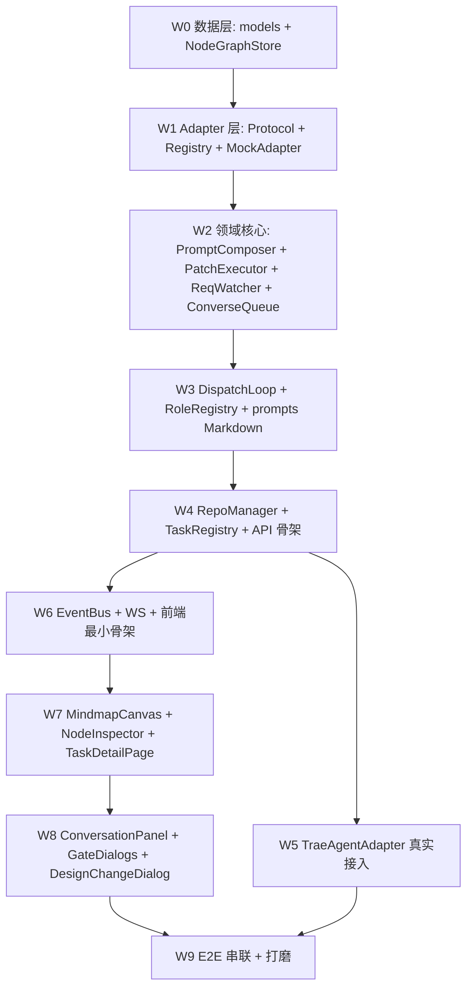

## 定位

本 plan 基于 `[基于trae-agent的思维导图需求拆解与sdd_tdd执行系统-一期全局角色极简版_a7e3b91c.plan.md](/Users/mima1-6/.cursor/plans/基于trae-agent的思维导图需求拆解与sdd_tdd执行系统-一期全局角色极简版_a7e3b91c.plan.md)` 定义的需求与架构，**只负责 "要写哪些代码、每块代码的函数签名 / 组件边界 / 测试需求"**。任何需求/数据模型/交互决策以需求 plan 为准，不在此重复。

## 目录结构（建议）

```
backend/
  orch/
    models/             # Pydantic + SQLAlchemy 模型
    store/              # NodeGraphStore (SQLite)
    domain/             # 核心业务
    adapters/           # 适配器层
    event_bus/          # WS 事件
    api/                # FastAPI 路由
    prompts/            # 4 角色 system_prompt Markdown
  tests/{unit,integration,e2e}/
frontend/
  src/{pages,components,hooks,stores,api}/
  tests/{unit,integration}/
```

## 一、后端数据层

### M1. `models/` —— 领域模型

参考需求 plan 3.0/3.1 小节；用 Pydantic + SQLAlchemy 双层（API 用 Pydantic，DB 用 SQLAlchemy）。

模块清单：

- `models/task.py`：`Task`, `TaskStatus`, `Repo`, `RepoStatus`
  - `Task` 字段：`id`, `title`, `description`, `workspace_path`, `status`, `execution_mode="inherit"`, `role_config_override`, `task_branch`（非空，TaskRegistry 自动生成默认值），`ppe_lane: str | None`, `created_at`, `updated_at`
  - **移除**：`max_design_rounds_req`, `max_design_rounds_arch`（用 `domain/constants.DEFAULT_MAX_ROUNDS = 5`）
- `models/node.py`：`NodeKind`, `NodeStatus`, `Node`, `ArchExtra`, `NodeHint`, `HintCategory`, `HintWeight`
- `models/edge.py`：`Edge`, `EdgeKind`
- `models/turn.py`：`Turn`, `TurnRole`, `TurnPhase`, `MemoryArtifactRef`
- `models/hitl.py`：`HitlDecision`, `HitlAction`, `HitlGate`
- `models/patch.py`：`ProposedPatch`, `PatchOp`, `PatchOpKind`
  - `PatchOpKind` 枚举：`add_node | modify_node | delete_node | add_edge | remove_edge | add_repo`
  - 新增 `AddRepoOp`（Pydantic 子模型）：字段 `git_url: str`, `name: str`, `base_branch: str`
- `domain/constants.py`：`DEFAULT_MAX_ROUNDS = 5`, `DEFAULT_RECENT_K = 5`（prompt 注入历史轮数）

单元测试：
- `test_models_serialization.py`：每个模型 JSON 往返无损
- `test_models_validation.py`：NodeKind 硬约束（ARCH 不嵌套、叶 REQ 禁挂 ARCH、CODE/TEST 父必须是 ARCH）的 Pydantic validator；HintCategory 枚举闭合；`PatchOpKind` 含 `add_repo`

### M2. `store/node_graph_store.py` —— SQLite 持久化

关键函数：

- `NodeGraphStore(db_path: Path)`
- `create_task(task: Task) -> Task`
- `list_tasks(status_filter: list[TaskStatus] | None) -> list[Task]`
- `get_task(task_id: str) -> Task`
- `update_task_status(task_id: str, status: TaskStatus) -> None`
- `insert_repo(repo: Repo) -> Repo` / `update_repo_commits(repo_id, base_hash, init_hash)`
- `insert_node(node: Node) -> Node`
- `update_node(node_id: str, patch: dict) -> Node`
- `delete_node(node_id: str) -> None`（仅 pending / design_pending 状态允许）
- `get_subtree(root_node_id: str) -> list[Node]`
- `query_nodes_by_kind(task_id: str, kind: NodeKind) -> list[Node]`
- `insert_edge(edge: Edge)` / `delete_edge(edge_id)`
- `append_turn(turn: Turn) -> Turn`（append-only）
- `list_turns(task_id, role=None, phase=None) -> list[Turn]`
- `insert_hitl(decision: HitlDecision) -> HitlDecision`
- `validate_patch(ops: list[PatchOp]) -> ValidationResult`（硬约束校验，见 3.1.7）
- `apply_patch_atomic(ops: list[PatchOp]) -> AppliedSummary`（事务内批量应用，失败整体回滚）

单元测试：
- `test_node_graph_store_crud.py`：基础 CRUD
- `test_node_graph_store_constraints.py`：插入违反硬约束的 node（ARCH 嵌套 / CODE 父非 ARCH）必须抛异常
- `test_node_graph_store_atomic_patch.py`：混合 ops 中一条失败 → 整批回滚
- `test_node_graph_store_task_isolation.py`：多 task 并发读写互不污染（按 task_id 分区）
- `test_node_graph_store_append_only_turn.py`：Turn 只能 append 不能 modify

## 二、后端核心业务层

### M3. `domain/task_registry.py`

函数：
- `TaskRegistry(store, repo_mgr, dispatch_factory, workspace_base_dir)`
- `create_task(title: str, root_req_text: str, *, task_branch: str | None = None, ppe_lane: str | None = None, role_overrides: dict | None = None) -> Task`
  - 工作流：
    1. 若 `task_branch is None` → 按 `orch/<short_task_id>/<slugify(title)>` 规则生成
    2. `store.create_task(Task(...))` 插入 Task 行（status=`created`，**无 Repo 记录**）
    3. `repo_mgr.prepare_empty_workspace(task_id)`（只 mkdir workspace + `.orch/` 子目录，不 clone）
    4. `store.insert_node(Node(kind=REQ, title="root", description=root_req_text, ...))`（种根 REQ）
    5. `dispatch_factory.build(task_id).spawn()` 启动协程
- `get_running_loop(task_id) -> DispatchLoop | None`
- `archive_task(task_id) -> None`
- `list_active() -> list[Task]`
- 内部：`_autogen_task_branch(task_id, title) -> str`（实现 slug + short_id 规则，纯函数可独立测）

单元测试：
- `test_task_registry_create_no_repos_no_rounds.py`：mock RepoManager + DispatchFactory，验证 RepoManager.**clone 不被调**（只调 prepare_empty_workspace）、插入 Task 行、seed root REQ 节点
- `test_task_registry_autogen_task_branch.py`：`task_branch=None` 触发 `_autogen_task_branch`；验证命名格式 + slug 不含空格 / 特殊字符
- `test_task_registry_explicit_task_branch.py`：用户给定 task_branch 时原样保留
- `test_task_registry_ppe_lane_persisted.py`：ppe_lane 传入正确落到 store
- `test_task_registry_archive.py`：停止协程 + 更新状态

### M4. `domain/repo_manager.py`

函数：
- `RepoManager(workspace_base_dir)`
- `workspace_dir_of(task_id: str) -> Path` —— 纯函数：返回 `<base>/task_<id>/` 路径
- `prepare_empty_workspace(task_id: str) -> Path` —— 只 mkdir（含 `.orch/` 子目录），不 clone
- `clone_repo(task: Task, spec: AddRepoSpec) -> Repo` —— 按单个 add_repo 规范同步 clone：
  - 校验 `spec.name` 在 Task 内未重复（查 store）
  - `git clone --branch <base_branch> --single-branch <git_url> <workspace>/<name>`
  - `cd <name> && git checkout -b <task.task_branch>`
  - record `base_commit_hash`
  - `git commit --allow-empty -m "[orch] task start: <title>" -m "task_id: ..." -m ...`
  - record `init_commit_hash`
  - 构造 `Repo` 并返回（不在此插 store；由 PatchExecutor 调用端在事务内插入）
- `resolve_path(task_id: str, repo_name: str) -> Path`
- `cleanup_task_workspace(task_id: str)`

**已移除**：任何"批量 clone_all" / "Task 创建时 clone" 类函数——一期只剩按需单 clone。

单元测试（用临时 bare repo 作为上游）：
- `test_repo_manager_prepare_empty_workspace.py`：mkdir 成功 + 无任何 clone 副作用 + `.orch/` 存在
- `test_repo_manager_clone_single_repo.py`：clone + 切支 + 空 commit 全流程，验证 base_hash ≠ init_hash
- `test_repo_manager_clone_reuses_prepared_workspace.py`：先 prepare 再 clone，不重建 workspace
- `test_repo_manager_clone_duplicate_name_in_task_rejected.py`：同 task 内 name 冲突抛异常
- `test_repo_manager_two_add_repos_independent_clones.py`：同一 task 先后 clone 两个不同 repo，互不污染
- `test_repo_manager_empty_commit_metadata.py`：空 commit 的 message 含 task_id / created_by / root_requirement 摘要
- `test_repo_manager_clone_failure_leaves_workspace_clean.py`：clone 失败（URL 不通）→ 未完成目录被清除（方便 patch 整批回滚）
- `test_repo_manager_resolve_path.py`：路径解析正确 & 越界路径拒绝

### M5. `domain/role_config.py` + `domain/role_registry.py`

- `RoleConfig`：从 YAML + prompt Markdown 加载 4 角色默认配置（system_prompt_template / default_adapter）
  - **已移除** `max_rounds` 配置项（走全局常量 `DEFAULT_MAX_ROUNDS`）
- `load_role_configs(path: Path) -> dict[RoleName, RoleConfig]`
- `RoleAgentRegistry(task, adapter_registry, role_configs)`
  - 构造时拿整个 `Task` 对象（而非只 task_id），为了把 `task.ppe_lane` 透传给 session.env
  - `get_or_create_session(role_name) -> RoleSession`
  - `RoleSession` 持有：`system_prompt`, `adapter`, `trajectory_path`, `memory_refs: list[MemoryArtifactRef]`, `history: list[Turn]`, `env: dict[str, str]`（含 `PPE_LANE` 当 task.ppe_lane 非空）

单元测试：
- `test_role_config_load.py`：YAML + md 读取；覆盖 override 逻辑
- `test_role_config_yaml_has_no_max_rounds.py`：默认 YAML 解析结果不包含 max_rounds 键（防止配置漂移）
- `test_role_registry_session_lifecycle.py`：创建 → 缓存命中 → destroy
- `test_role_registry_adapter_binding.py`：用户覆写 adapter 生效
- `test_role_registry_session_env_ppe_lane_when_set.py`：Task.ppe_lane="gray-1" → RoleSession.env["PPE_LANE"] == "gray-1"
- `test_role_registry_session_env_no_ppe_lane_when_none.py`：Task.ppe_lane=None → RoleSession.env 无 PPE_LANE 键

### M6. `domain/prompt_composer.py`

函数签名保持不变；**每个 compose_* 输出的模板数据字典都扩展这些共享变量**：`task_branch`, `ppe_lane`（缺省时变量为 None，模板用 `` 处理）, `cloned_repos: list[RepoSummary]`（每条 `{name, local_path, base_branch}`）。

- `PromptComposer(store)`
- `compose_req_battle_cold(task) -> UserMessage`
- `compose_req_battle_critic_feedback(task, last_proposer_turn) -> UserMessage`
- `compose_arch_battle_cold(task) -> UserMessage`
- `compose_arch_battle_critic(task, last_designer_turn) -> UserMessage`
- `compose_converse(task, role, user_msg, referenced_node_ids, history_k=DEFAULT_RECENT_K) -> UserMessage`
- `compose_inherit_code_impl(task, code_node, recent_k_turns) -> UserMessage`（prompt injection 实现 inherit 记忆）
- `compose_inherit_test_impl(task, test_node, recent_k_turns) -> UserMessage`
- `compose_impl_verification(task, recent_k_turns) -> UserMessage`
- `compose_gate2_req_revision(task, role, user_msg) -> UserMessage`
- 内部：
  - `_render_tree_view(task, kinds) -> str`
  - `_expand_node_refs(node_ids) -> str`
  - `_recent_k_history(role, k) -> str`
  - `_load_cloned_repos(task_id) -> list[RepoSummary]` —— 从 store 查 Repo 行，只选 status=`ready`

单元测试：
- `test_prompt_composer_tree_view.py`：树渲染符合固定格式（缩进 / 状态标记 / hints 聚合）
- `test_prompt_composer_node_ref_expansion.py`：`@node123` → 完整节点描述段落
- `test_prompt_composer_history_injection.py`：inherit 模式下 recent K 轮正确拼接
- `test_prompt_composer_task_branch_injected.py`：任何 stage 的 compose 都在渲染结果里出现 `task_branch` 值
- `test_prompt_composer_ppe_lane_injected_when_set.py`：Task.ppe_lane 非空时渲染文本含"PPE 泳道 <值>"
- `test_prompt_composer_ppe_lane_omitted_when_none.py`：ppe_lane=None 时不出现相关段落（避免给 agent 噪音）
- `test_prompt_composer_cloned_repos_empty.py`：零仓库时列为"尚无已 clone 仓库"
- `test_prompt_composer_cloned_repos_list.py`：有 N 个时列出 name / local_path / base_branch
- `test_prompt_composer_stage_coverage.py`：每个 compose_* 都能无异常产出字符串 + 关键占位符都被填充（正则匹配）

### M7. `domain/patch_executor.py`

函数：
- `PatchProposalExecutor(store, repo_mgr)` —— 新增 `repo_mgr` 依赖，用于响应 `add_repo` op
- `parse_xml(raw: str) -> ProposedPatch`（XML 外壳 + YAML 内容，容错失败抛 ParseError；识别 `add_repo` op 并反序列化为 `AddRepoOp`）
- `validate_guardrails(patch: ProposedPatch, source_turn_role: TurnRole) -> GuardrailReport`：
  - 兜底硬守卫：命中 `remove_node` / `remove_edge` / 对 done 节点 `modify_node` → `requires_hitl=True`
  - **权限守卫**：`add_repo` op 非 `arch_designer` 发起 → `requires_hitl=False` 但直接 `reject`（返回字段 `reject_reason="add_repo limited to arch_designer"`）
- `apply(patch: ProposedPatch, source_turn_id: str, source_turn_role: TurnRole) -> ApplyResult`：
  - 先跑 guardrails；命中 reject → 整批回滚，返回 `[VALIDATION_ERROR]` error_feedback
  - 在单个 DB 事务里按 ops 顺序应用
  - 遇到 `add_repo` op：**同步**调 `repo_mgr.clone_repo(task, spec)`；成功则把 Repo 行插入 store；失败则抛 RepoCloneError（触发整批回滚 + error_feedback）
  - 其它 ops 走原有逻辑
- `format_error_feedback(validation_err | reject_reason | clone_error) -> str`

单元测试：
- `test_patch_parse_valid.py`：合法 XML+YAML 解析成功
- `test_patch_parse_malformed.py`：缺标签 / YAML 语法错 → ParseError
- `test_patch_parse_add_repo_op.py`：`- op: add_repo` 正确反序列化为 `AddRepoOp`
- `test_patch_guardrails.py`：remove_node / remove_edge / modify done 三类命中 requires_hitl；非命中正常通过
- `test_patch_guardrail_add_repo_by_arch_designer_passes.py`
- `test_patch_guardrail_add_repo_by_other_role_rejected.py`：req_decomposer / req_completeness_critic / arch_coverage_critic 三种角色分别测
- `test_patch_apply_atomic.py`：批量 ops 中某条违约 → 整体回滚、error_feedback 含具体原因
- `test_patch_apply_success.py`：成功应用后 summary 正确、store 状态一致
- `test_patch_apply_add_repo_calls_repo_mgr.py`：MockRepoMgr 验证 `clone_repo` 被同步调用
- `test_patch_apply_add_repo_clone_success_inserts_repo_row.py`
- `test_patch_apply_add_repo_clone_failure_rolls_back_entire_patch.py`：fake clone 抛异常 → 其他 ops 也全不生效
- `test_patch_apply_add_repo_duplicate_name_rejected.py`：第二条 add_repo 同 name 触发回滚

### M8. `domain/dispatch_loop.py`（核心编排）

函数：
- `DispatchLoop(task_id, store, role_registry, prompt_composer, patch_executor, event_bus, req_watcher, converse_queue)`
- `async run()` —— 主协程，按阶段跑：
  - `_run_req_battle()` → Gate 1
  - `_run_arch_battle()` → Gate 2
  - `_run_inherit_execution()` → 最终 done
- `_battle_round(role_pair, prompt_fn)` → 跑一轮生产者 + 批评者；返回 `(producer_turn, critic_turn)`
- `_run_battle_to_convergence(role_pair, prompt_fn) -> BattleResult`：外层循环，每轮结束后跑收敛判定，到达 `DEFAULT_MAX_ROUNDS=5` 或收敛即退出
- `_detect_convergence(prev_critic_turn, curr_critic_turn) -> ConvergenceVerdict`：
  - 若 curr_critic_turn.output_text 含 `[CONVERGED]` → `explicit`
  - 若 prev 和 curr 的"问题列表段落"文本哈希一致 → `implicit_no_new_issues`
  - 否则 → `continue`
  - 工程实现：对 critic.output_text 先剥离 `[CONVERGED]` 标记，再做 sha256；文本前先做 whitespace-normalize
- `_hitl_gate(gate: HitlGate)` → 等待 HitlDecision，再根据 action 分支（approve / reject_with_comment / approve_partial / continue_battle）
- `_dispatch_code_impl(code_node)` / `_dispatch_test_impl(test_node)` —— 单节点 inherit 调度
- `_handle_converse(conv_msg)` —— 从 ConverseQueue 出队处理
- `_handle_design_change_request(turn)` —— 识别 `[DESIGN_CHANGE_REQUEST]` → halt + 通知前端 + 等待 user approve/reject
- `_handle_req_revision_trigger(turn)` —— Gate 2 REQ 变更 → 切回 arch_battle_running 并重新入队 arch_designer
- `_parse_machine_markers(text) -> list[Marker]` —— 识别 `[CONVERGED]` / `[NODE_DONE]` / `[NODE_FAILED]` / `[VALIDATION_ERROR]` / `[DESIGN_CHANGE_REQUEST]`

**常量**（来自 `domain/constants.py`）：`DEFAULT_MAX_ROUNDS = 5`, `DEFAULT_RECENT_K = 5`；DispatchLoop 不再接收轮数参数。

单元测试（用 MockAdapter 喂固定输出）：
- `test_dispatch_req_battle_explicit_converged.py`：critic 第 2 轮输出 `[CONVERGED]` → battle 退出并进入 Gate 1
- `test_dispatch_req_battle_implicit_convergence.py`：critic 连续 2 轮问题列表文本完全一致 → 同样退出（不需要 [CONVERGED]）
- `test_dispatch_arch_battle_max_rounds_5.py`：5 轮都未收敛 → 自动进入 Gate 2
- `test_dispatch_convergence_detector_whitespace_normalize.py`：同一问题列表只有空白差异也视为一致
- `test_dispatch_convergence_detector_different_issues_continues.py`：问题列表有新增/变更 → `continue`
- `test_dispatch_gate_approve.py`：HITL approve → 正确进入下阶段
- `test_dispatch_gate_reject_with_comment.py`：reject → 新一轮 battle 带 comment 作为 hint
- `test_dispatch_continue_battle.py`：continue_battle 追加 N 轮无上限
- `test_dispatch_approve_partial.py`：per-node 决议落到 hints
- `test_dispatch_inherit_pipeline.py`：ARCH → 逐 CODE → 逐 TEST 串行执行
- `test_dispatch_inherit_pipeline_with_add_repo.py`：MockAdapter 脚本在 CODE 实施第一轮输出 `<add_repo>` + 后续 CODE 实施能读到新 Repo 在 `cloned_repos` 列表里
- `test_dispatch_design_change_request.py`：识别 marker → halt + 事件广播
- `test_dispatch_node_failed_halt.py`：CODE 返回 `[NODE_FAILED]` → halt + 弹窗事件
- `test_dispatch_converse_enqueue.py`：运行中收到对话消息进队 & 空闲时处理
- `test_dispatch_req_revision_loop.py`：Gate 2 REQ 变更触发 arch_designer 续跑

### M9. `domain/req_watcher.py`

函数：
- `ReqWatcher(store, dispatch_loop_ref)`
- `on_patch_applied(patch_summary)` → 若当前 stage=gate2_waiting 且 patch 含 REQ 节点 add/modify/delete → 调 `dispatch_loop.trigger_req_revision()`

单元测试：
- `test_req_watcher_trigger.py`：mock 各种阶段 + patch 组合，验证触发条件精确
- `test_req_watcher_no_trigger_outside_gate2.py`：非 gate2 状态 REQ 变更不触发续跑

### M10. `domain/converse_queue.py`

函数：
- `ConverseQueue(task_id)`
- `enqueue(msg: ConverseMsg) -> None`
- `async dequeue() -> ConverseMsg`（DispatchLoop 空闲时调用）
- `pending_count() -> int`

单元测试：
- `test_converse_queue_fifo.py`：严格 FIFO
- `test_converse_queue_backpressure.py`：超出阈值警告

## 三、后端适配器层

### M11. `adapters/base.py` + `adapters/registry.py`

- `class AdapterCapabilities`：`supports_session_resume: bool`, `supports_streaming: bool`, `native_tool_use: bool`
- `class CodingAgentAdapter(Protocol)`：
  - `name: str`
  - `capabilities: AdapterCapabilities`
  - `async start_session(role_name, system_prompt, cwd, env) -> SessionHandle`
  - `async send(session, user_message, stream_callback) -> AssistantReply`
  - `async close(session) -> None`
  - `resolve_artifacts(session) -> list[MemoryArtifactRef]`
- `class AdapterRegistry`：`register(adapter_cls)` / `get(name)` / `list_names()`；启动时扫描 `adapters/` 包自动装载

单元测试：
- `test_adapter_protocol_surface.py`：Protocol 定义的方法全在；mypy-style 静态检查（若用 mypy 跑）
- `test_adapter_registry_scan.py`：放入 fake adapter 模块自动被装载

### M12. `adapters/trae.py` —— `TraeAgentAdapter`

职责：subprocess 调用 trae CLI（`trae-cli run`）；每轮一次 subprocess；解析 trajectory JSON；不支持 native resume。

函数：
- `TraeAgentAdapter(trae_binary, default_config_path: Path = Path("config/trae_default.yaml"))`
- `async start_session(role_name, system_prompt, cwd, env: dict[str, str]) -> SessionHandle`
  - 只创建 SessionHandle，不实际起进程（trae 每轮独立进程）
  - SessionHandle 记下 `env`（包含 RoleSession 传入的 `PPE_LANE` 值，若 Task.ppe_lane 非空）
- `async send(session, user_message, stream_cb) -> AssistantReply`：
  - 拼 `trae-cli run <prompt> --config-file=<resolved_config>` + 注入 system_prompt 为前缀
  - **`<resolved_config>` 的三级优先级**：`RoleConfig.trae_config_path`（用户覆写） → `<workspace>/.orch/trae_config.yaml`（workspace 覆写） → `default_config_path`（ship 默认）
  - **subprocess env = 当前 os.environ + session.env**（若 `PPE_LANE` 在 session.env 中则透传）
  - 捕获 stdout + trajectory 文件
  - tail 轮询 trajectory（1s 间隔）增量输出给 stream_cb
  - 结束后 parse 最终消息
- `_parse_trajectory(path) -> list[StreamEvent]`
- `resolve_artifacts(session)` → 返回 trajectory 文件列表

**新增**：ship 默认 `config/trae_default.yaml`（仓库内），至少包含：
```yaml
# config/trae_default.yaml（仓库 ship 默认，覆盖三级优先级的最底层）
agents:
  trae_agent:
    tools:
      - bash
      - str_replace_based_edit_tool
      - sequentialthinking
      - task_done
      - mcp_tool

mcp_servers:
  playwright:
    command: npx
    args:
      - "-y"
      - "@playwright/mcp@latest"
      - "--browser=chrome"
      - "--user-data-dir=~/.orch/browser-profiles/default"
      # 支持通过环境变量覆写：读取 ORCH_BROWSER_PROFILE_DIR

allow_mcp_servers:
  - playwright
```

**新增模块级函数** `_ensure_playwright_profile(profile_dir: Path | None = None) -> Path`：
- `profile_dir` 默认从 `os.environ.get("ORCH_BROWSER_PROFILE_DIR", "~/.orch/browser-profiles/default")` 解析，`expanduser()`
- 若目录不存在 → `mkdir(parents=True, exist_ok=True)` 并在日志里打印：
  ```
  [orch] playwright profile 目录已创建: <path>
  [orch] 首次使用时请在该 profile 浏览器内登录你需要访问的文档站（飞书/Notion/...）
  [orch] 登录一次后 cookie 持久化到该目录，后续所有任务复用
  ```
- 若目录存在但无 `Default/` 子目录（Chromium 启动前形态）→ 视为 "未登录过" → 打印同上引导日志
- 返回 resolved profile_dir path
- 被 orchestrator 在两处调用：启动 lifespan（M15）、以及 `TraeAgentAdapter.__init__` 自检一次

**RoleSession 扩展**（见 M5）：`RoleSession.env` 字段记录本 session 使用的环境变量——`role_registry.get_or_create_session()` 会根据 Task.ppe_lane 填 `{"PPE_LANE": task.ppe_lane}` 或空字典。

单元测试（不真调 trae，用 fake trae 脚本）：
- `test_trae_adapter_single_turn.py`：fake trae 写出 trajectory → adapter 正确解析
- `test_trae_adapter_stream_callback.py`：stream_cb 按 trajectory 增量触发
- `test_trae_adapter_crash_handling.py`：fake trae 退出码非 0 → 抛 AdapterError
- `test_trae_adapter_concurrent_sessions.py`：4 角色并行调用互不干扰
- `test_trae_adapter_env_ppe_lane_passthrough.py`：session.env 含 PPE_LANE → fake trae 进程 `env` 中读到该值
- `test_trae_adapter_env_ppe_lane_absent_when_none.py`：session.env 无 PPE_LANE → fake trae 进程 env 中该键不存在（不为空字符串）
- `test_trae_adapter_uses_shipped_config_with_playwright_mcp.py`：不传覆写时，subprocess 命令行含 `--config-file=config/trae_default.yaml`；读取该文件 YAML 断言 `mcp_servers.playwright` 存在、`allow_mcp_servers` 含 `playwright`、`--user-data-dir` 指向默认或 env 覆写的 profile 路径
- `test_ensure_playwright_profile_creates_dir.py`：临时 HOME，profile 不存在 → 调用后目录存在 + 日志含引导文案
- `test_ensure_playwright_profile_respects_env_override.py`：设 `ORCH_BROWSER_PROFILE_DIR=/tmp/foo` → 返回 `/tmp/foo`
- `test_trae_adapter_config_override_user_wins_over_ship.py`：传入 `role_config.trae_config_path=/custom/c.yaml` → subprocess 走 custom 而非 ship 默认

### M13. `adapters/mock.py` —— `MockAdapter`

职责：测试专用，按 `scripted_outputs: list[str]` 按序返回，或接收 callback 自定义。

函数：
- `MockAdapter(scripted_outputs=None, callback=None)`
- `set_next_reply(text)`；`set_scripted(list)`
- `send()` 返回预设内容

单元测试：
- `test_mock_adapter_scripted.py`
- `test_mock_adapter_callback.py`
- 本 adapter 本身是测试工具，所以测试主要验证其可被用作 fixture

## 四、后端接口层

### M14. `event_bus/` —— 事件总线 + WS Console

- `event_bus/bus.py`：`EventBus` —— 按 task_id 订阅/广播；事件类型：`TurnStreamedEvent`, `PatchAppliedEvent`, `GateWaitingEvent`, `DesignChangeRequestEvent`, `NodeFailedEvent`, `TaskStateChangedEvent`
- `event_bus/ws_console.py`：`WebSocketConsole`（trae 流消息的订阅方式，参考主 plan 7.x）

单元测试：
- `test_event_bus_subscribe.py`：多订阅者同时收到事件
- `test_event_bus_task_isolation.py`：订阅 A 的不收 B 的事件

### M15. `api/` —— FastAPI 路由

模块：
- `api/main.py`：`create_app()`, lifespan 顺序：
  1. 初始化 SQLite store + 迁移
  2. 加载 RoleConfig
  3. 扫描 `AdapterRegistry` 注册可用 adapter
  4. **调 `TraeAgentAdapter._ensure_playwright_profile()` 预检 profile 目录**；首次使用写引导日志到 `logs/orch.log` 并通过 `GET /system/status` API 暴露一个 `playwright_profile_bootstrap: bool` 字段，前端可在首启时展示引导 banner（二期再做）
  5. 初始化 EventBus / DispatchLoop pool
  6. yield → 服务运行
  7. shutdown：关闭所有 RoleSession / DispatchLoop / DB 连接
- `api/tasks.py`：
  - `POST /tasks` → TaskRegistry.create_task
    - 入参 `CreateTaskRequest`（Pydantic）：`title: str`, `root_requirement: str`, `task_branch: str | None = None`, `ppe_lane: str | None = None`, `role_overrides: dict | None = None`
    - **严格拒绝**旧字段：`repos_spec` / `max_design_rounds_req` / `max_design_rounds_arch`（Pydantic `extra = forbid` 或手工校验，返回 422）
  - `GET /tasks` → 列表
  - `GET /tasks/{id}` → 详情含节点/边/最近 Turn
  - `POST /tasks/{id}/archive`
- `api/nodes.py`（只读）：
  - `GET /tasks/{id}/nodes` → 全量图
  - `GET /tasks/{id}/nodes/{node_id}` → 节点含 hints
- `api/turns.py`：
  - `GET /tasks/{id}/turns?role=&phase=` → 审计日志
- `api/conversations.py`：
  - `POST /tasks/{id}/conversations` body `{role, message, referenced_node_ids}` → enqueue 到 ConverseQueue
  - `GET /tasks/{id}/conversations?role=` → 历史
- `api/hitl.py`：
  - `POST /tasks/{id}/hitl` body `{gate, action, payload}` → 产生 HitlDecision
  - `POST /tasks/{id}/design-change` body `{approved, comment}` → 回应 DesignChangeRequest
- `api/adapters.py`：`GET /adapters` → 枚举
- `api/system.py`：`GET /system/status` → 返回 `{ version, playwright_profile_dir, playwright_profile_bootstrap: bool, adapters: [...] }`；前端首启时读取 `playwright_profile_bootstrap=true` 可显示引导 banner（二期）
- `api/ws.py`：`WS /tasks/{id}/events` → 桥 EventBus

单元测试：
- `test_api_tasks_create_happy_path.py`：最小必填（title + root_requirement）→ 返回 Task + 后台启动协程
- `test_api_tasks_create_accepts_task_branch_and_ppe_lane.py`
- `test_api_tasks_create_autogen_task_branch_when_missing.py`
- `test_api_tasks_create_rejects_legacy_repos_spec_field.py`：body 含 `repos_spec` → 422
- `test_api_tasks_create_rejects_legacy_max_rounds_fields.py`：body 含 `max_design_rounds_req` → 422
- `test_api_hitl_approve.py`：POST approve → HitlDecision 行插入 + dispatch_loop 解除等待
- `test_api_conversations_enqueue.py`：入队成功 + 空闲时被处理
- `test_api_ws_event_stream.py`：连上 WS 收到心跳 + 真实事件
- `test_api_adapters_list.py`：一期返回 trae + mock 两项

## 五、后端 prompt 资源

### M16. `prompts/` —— 4 角色 Markdown 模板

- `prompts/preamble.md`（A.0 共享）
- `prompts/req_decomposer.md`（A.1 system_prompt 段）
- `prompts/req_completeness_critic.md`（A.2）
- `prompts/arch_designer.md`（A.3）—— 含 § SDD / § TDD / § 执行期设计修订规则 / § ARCH 阶段 TEST 骨架
- `prompts/arch_coverage_critic.md`（A.4）—— 含 § SDD/TDD 合规校验
- `prompts/user_messages/*.jinja`（每个 compose_* 对应一个模板）

单元测试：
- `test_prompt_files_present.py`：所有文件存在 + 含关键 marker（`§` 小节标题 / 占位符命名一致）
- `test_prompt_templates_render.py`：用固定 fixture 数据渲染各 jinja 模板，对比 snapshot

## 六、前端

### F1. `api/client.ts` + `api/types.ts`

- TypeScript 类型（与后端 Pydantic 对齐，用 `openapi-typescript` 自动生成 + 手工精简）
- `apiClient`：封装 fetch，含 `createTask` / `getTask` / `listTasks` / `postHitl` / `postConversation` / `postDesignChangeResponse` / `listAdapters`
- `connectWs(taskId, handlers)` → 返回订阅句柄

单元测试（Vitest）：
- `client.test.ts`：mock fetch 验证路径 / payload
- `ws.test.ts`：mock WebSocket 验证事件分发

### F2. `stores/taskStore.ts`（Zustand）

- State：`currentTaskId`, `nodes: Record<string, Node>`, `edges: Edge[]`, `turns: Turn[]`, `repos: Repo[]`, `stage: TaskStage`, `pendingGate: HitlGate | null`, `pendingDesignChange: DesignChangeReq | null`, `pendingNodeFailure: NodeFailureEvent | null`
- UI 派生 state（可放 `uiStore` 单独管）：`activeRoleTab: RoleName`, `roleTabMeta: Record<RoleName, TabMeta>`, `roleTabFilters: Record<RoleName, { includeBattle: boolean; includeSystem: boolean }>`, `roleTabDrafts: Record<RoleName, string>`, `roleTabChips: Record<RoleName, string[]>`, `splitRatio: number`, `leftCollapsed: boolean`, `rightCollapsed: boolean`, `reposPopoverOpen: boolean`, `auditModalOpen: boolean`, `pinnedNodeCards: NodeCardState[]`, `activeUnpinnedNodeCard: NodeCardState | null`
- Actions：`hydrate(task)` / `applyPatchSummary(summary)`（含 `added_repos` 合并到 repos）/ `appendTurn(turn)`（含更新 `roleTabMeta.unreadCount/streaming`）/ `setGateWaiting(gate)` / `setDesignChange(req)` / `setNodeFailure(evt)` / `clearBlockers()` / `setActiveRoleTab(role)`（副作用：清该 role 的 unreadCount）/ `appendChipToRoleInput(role, nodeId)` / `setRoleDraft(role, text)` / `setRoleFilter(role, filter)` / `setSplitRatio(n)` / `toggleLeftCollapsed()` / `toggleRightCollapsed()` / `openReposPopover()` / `closeReposPopover()` / `openAuditModal()` / `closeAuditModal()` / `pinNodeCard(node, pos)` / `unpinNodeCard(nodeId)` / `setUnpinnedNodeCard(node, pos)` / `closeAllUnpinnedCards()`

单元测试：
- `taskStore.test.ts`：reducer 纯性验证 / 事件序列最终一致
- `taskStore_role_tab_meta.test.ts`：WS `TurnStreamed` 到达时 `roleTabMeta[turn.role].streaming=true`；Turn 完成时 `streaming=false` + `unreadCount++`（除非该 tab 当前 active）
- `taskStore_repos_merge.test.ts`：`applyPatchSummary` 含 `added_repos=[...]` → `repos` 追加且 `ReposChipButton` 数字 +N
- `taskStore_pinned_cards.test.ts`：多卡管理 / 未钉卡被新 click 替换 / 钉住卡不受影响

### F3. `hooks/useWebSocket.ts`

- `useTaskWs(taskId)` —— 挂 `connectWs` + 事件分发到 taskStore

### F4. `pages/TaskListPage.tsx`

- 渲染 `GET /tasks` 列表
- 点击"新建任务" → 弹 TaskConfigDialog
- 点击 item → 跳 TaskDetailPage

单元测试（RTL）：
- `TaskListPage.test.tsx`：列表渲染、空态、跳转事件

### F5. `components/TaskConfigDialog.tsx`

字段：
- `title`（必填）
- `root_requirement`（多行必填；用户在这里用自然语言描述需要涉及哪些仓库、部署、背景等；arch_designer 在 ARCH 阶段会基于此懒声明 `add_repo`）
- `task_branch`（可留空；留空 placeholder 显示 "留空将自动生成 orch/<task_id_short>/<title_slug>"）
- `ppe_lane`（可选文本，PPE 部署/测试用）
- `per-role adapter` 下拉（一期只 trae；可折叠"高级"分区）
- **已删除**：repos 子表单（useFieldArray）、max_design_rounds_req/arch 两个输入框
- 提交 → `apiClient.createTask({ title, root_requirement, task_branch?, ppe_lane?, role_overrides? })`

测试：
- `TaskConfigDialog_required_fields_block_submit.test.tsx`：缺 title / root_requirement 不能提交
- `TaskConfigDialog_task_branch_optional_placeholder.test.tsx`：placeholder 显示默认生成规则预览
- `TaskConfigDialog_ppe_lane_optional.test.tsx`：可空可填
- `TaskConfigDialog_advanced_adapter_defaults_trae.test.tsx`：一期下拉只有 trae
- `TaskConfigDialog_submit_payload_shape.test.tsx`：提交 body 不含 repos / max_rounds_*，仅含新 schema 字段
- `TaskConfigDialog_no_repos_subform.test.tsx`：确认页面没有"添加仓库"按钮/输入行（反向断言）

### F6. `pages/TaskDetailPage.tsx`

**两栏布局**：`<TopBar/>` + `<SplitPanelLayout left=<LeftPane/> right=<RightPane/> />` + `<OverlayLayer/>` + `<DialogLayer/>`。

- LeftPane：`MindmapCanvas` + `NodeFloatingCardLayer`（absolute 叠在画布内部）
- RightPane：`RolesTabBar` + `RoleConversationPane[activeRoleTab]`
- OverlayLayer：`ReposPopover` + `TurnAuditModal`（均默认隐藏，由 TopBar 按钮触发）
- DialogLayer：阻塞弹窗（`GateReviewDialog` / `DesignChangeDialog` / `NodeFailedDialog`）按 currentBlocker 优先级渲染
- TopBar：`BackButton` + `TaskTitleView` + `StageIndicator` + **`ReposChipButton`** + **`FullAuditButton`** + `ActionMenu`

### F6a. `components/layout/SplitPanelLayout.tsx`（新增）

函数签名：
```tsx
interface Props {
  left: ReactNode;
  right: ReactNode;
  ratioKey: string;            // localStorage key
  minLeftPx?: number;          // default 320
  minRightPx?: number;         // default 320
  collapsedWidthPx?: number;   // default 48
}
```

- 内部 state：`ratio` / `leftCollapsed` / `rightCollapsed`，全部持久化到 localStorage
- 渲染 flex 容器 `[LeftPane | SplitDivider | RightPane]`
- 折叠态：被折叠侧宽度锁 48px + 渲染展开按钮 + 可选侧栏图标列（由父传入 `collapsedRail` slot）
- Divider：`role="separator"` + 键盘左右箭头微调 ratio

### F6b. `components/layout/SplitDivider.tsx`（新增）

- 4px 垂直条 + 两个圆形按钮 `[◀]` `[▶]`
- 折叠态替换成对应展开按钮
- mousedown → document 挂 mousemove/mouseup 拖动

### F7. `components/MindmapCanvas.tsx`（reactflow）

- 只读：禁用拖拽/增删/编辑（reactflow `nodesDraggable={false}` 等）
- 按 NodeKind 着色 / 形状
- 点击节点 → `onNodeClick(node, clickEvent)` 给 `NodeFloatingCardLayer` 在点击位置浮出卡片
- 不再直接推给 NodeInspector / ConversationPanel（对话输入框的 @ chip 由 `NodeFloatingCard` 的"引用到对话"按钮主动添加到当前 tab）

测试：
- 快照 + 鼠标事件仅触发 onNodeClick，不修改图

### F8. `components/NodeFloatingCard.tsx`（原 NodeInspector 迁移）

职责：在 MindmapCanvas 区域内浮出的节点详情卡片；可钉住、可拖动、可多卡并存。

Props：
```tsx
interface Props {
  node: Node;
  initialPosition: { x: number; y: number };
  pinned: boolean;
  onPinToggle: () => void;
  onClose: () => void;
  onReferenceInChat: (nodeId: string) => void;
}
```

- 内部渲染：breadcrumb + kind badge + description + `HintList`（按 weight 排序）+ ARCH 节点的 design_content（`MarkdownRenderer` 渲染分小节）
- 工具栏按钮：📌 钉住（toggle） / 引用到对话 / 关闭 X
- 拖动：工具栏左侧抓手 mousedown → position 更新（限制在 MindmapCanvas 容器内）
- 尺寸：360px 宽，max-height 60vh，超出内部滚动
- 钉住态视觉：边框变色

测试：
- 各 NodeKind 切换渲染 / Markdown 渲染不 XSS / 钉住状态切换 / 关闭回调 / 引用到对话回调

### F8a. `components/NodeFloatingCardLayer.tsx`（新增）

- absolute 定位在 MindmapCanvas 上
- state：`pinnedCards: Map<nodeId, NodeCardState>` + `activeUnpinnedCard: NodeCardState | null`
- 接 mindmap 的 `onNodeClick(node, evt)`：
  - 若该 node 已在 pinnedCards → 调用已有卡的"高亮"即可
  - 否则：关闭 activeUnpinnedCard（如有），设为新的
- Esc 键：关闭 activeUnpinnedCard + 所有 pinnedCards 中被用户主动 unpin 的卡

### F9. `components/roles/RolesTabBar.tsx`（原 RoleSelector 替换）

Props：`roles: RoleName[]` / `activeRole: RoleName` / `onChange(role: RoleName)` / `tabMeta: Record<RoleName, TabMeta>`

`TabMeta`: `{ unreadCount, streaming, hasWarning, stageMatch: 'match' | 'queued' }`

- 4 个 tab + 右端 `[+]` 扩展位（一期 disabled）
- 每个 tab：角色简名 + 状态圆点（`● ◐ ○ ⚠`）+ 未读数 badge
- `stageMatch='queued'` 的 tab：加灰底 + tooltip

### F9a. `components/roles/RoleConversationPane.tsx`（原 ConversationPanel 主体）

- Props：`roleKey: RoleName` / `taskId: string`
- 结构：`<RoleTurnTimeline/>` + `<TurnFilterBar/>` + `<MessageInput/>`
- 切 tab 不卸载（React.memo + `display: none` 保留 state）
- 草稿 per-role 持久化到 localStorage (`orch.draft.<taskId>.<role>`)
- 发送 = `apiClient.postConversation({ role: roleKey, message, referenced_node_ids })`

### F9b. `components/roles/RoleTurnTimeline.tsx`（原 MessageHistory 改名）

- 渲染 `<TurnBubble>` 列表
- 每个 `TurnBubble` 含 `TurnOriginBadge` + `MachineMarkerBadge` + `StreamingMessage` + `AppliedPatchBadge` + `ErrorFeedbackBubble`
- 虚拟滚动支持长历史（超过 200 条时启用 react-virtuoso）

### F9c. `components/roles/TurnFilterBar.tsx`（新增）

- 底部两个复选框：`含 battle` / `含系统标记`
- 默认全勾；per-role 持久化到 localStorage (`orch.roleTabFilter.<role>`)

### F10. `components/GateReviewDialog.tsx`

- 弹窗展示双方最终论断 + 轮次轨迹
- 提供按钮：Approve / Reject with comment / Approve Partial（树上逐节点勾） / Continue Battle（追加 N 轮）
- 提交调 `/hitl`

测试：
- `GateReviewDialog.test.tsx`：approve_partial 未全勾不能提交 / comment reject 必填 comment

### F11. `components/DesignChangeDialog.tsx`

- 弹窗展示 agent 的 `[DESIGN_CHANGE_REQUEST]` 自然语言说明
- 按钮：Approve（可选 comment）/ Reject（必填 comment）
- 提交调 `/design-change`

测试：
- `DesignChangeDialog.test.tsx`：reject 必填 / 提交后关闭并解除 blocking

### F12. `components/TurnAuditPanel.tsx`（内容组件，放在 TurnAuditModal 里）

- 列表展示所有 Turn（按时间倒序）
- 可按 role / phase 过滤
- 每项可展开看 consumed_artifacts / produced_artifacts / payload_extra

测试：
- 过滤器正确性 / 大数据虚拟滚动不卡

### F12a. `components/overlay/TurnAuditModal.tsx`（新增）

- Props：`isOpen: boolean` / `onClose: () => void`
- 内部渲染 `<TurnAuditPanel/>`
- 全屏模态（90vw × 85vh），遮罩 rgba(0,0,0,0.4)
- 关闭：Esc / 背景点击 / 右上 X
- 关闭时焦点回到 `FullAuditButton`（accessibility `returnFocus`）
- `TurnAuditPanel` 的内部状态（filter / search）挂在父 `TaskDetailPage` 的 store（或 URL 参数），模态卸载只是隐藏 UI；再次打开时状态不丢

### F12b. `components/overlay/ReposPopover.tsx`（原 RepoListView 迁移）

- 由 TopBar 的 `ReposChipButton` 控制显示
- shadcn `Popover`，宽 360px
- 内容：空态文案 / Repo 列表（name / git_url 截断 / base_branch / task_branch / init_commit_hash[:7] / 本地路径 + 复制按钮）
- 订阅 WS `PatchAppliedEvent.summary.added_repos`，自动追加行
- 一期无删除按钮

### F12c. `components/topbar/ReposChipButton.tsx`（新增）

- 显示 `Repos(N)` chip，N 从 taskStore 的 `repos.length` 派生
- 点击 toggle `ReposPopover`

### F12d. `components/topbar/FullAuditButton.tsx`（新增）

- 显示 "全部 Turn" 文字按钮
- 点击 open `TurnAuditModal`

### F13. `hooks/useMindmapLayout.ts`

- 根据 nodes/edges 计算布局（按 REQ → ARCH → CODE/TEST 层级放置）
- 纯函数，便于测

测试：
- 给定树生成稳定坐标；节点增删后只做局部重排（避免全图抖动）

## 七、集成测试 / E2E

- `test_e2e_task_happy_path.py`：用 MockAdapter 跑通 REQ battle（含 [CONVERGED]）→ Gate1 approve → ARCH battle（arch_designer 脚本化发 add_repo op，RepoManager clone 临时 bare repo）→ Gate2 approve → inherit 执行 → done
- `test_e2e_task_zero_repo_flow.py`：用户 root_req 不需要代码（如"写一份架构文档"），整个流程里 arch_designer 不发 add_repo；workspace 全程空目录，任务正常结束
- `test_e2e_converse_auto_patch.py`：对话触发 patch 自动落地 + turn 日志正确
- `test_e2e_add_repo_clone_failure_rollback.py`：MockAdapter 发 add_repo 指向不可达 URL → 整批回滚 + VALIDATION_ERROR 回传 → 下一轮 agent 改用正确 URL 重试成功
- `test_e2e_non_arch_designer_add_repo_blocked.py`：req_decomposer 脚本化输出 add_repo op → Guardrail 拒绝 → VALIDATION_ERROR；REQ 树没有因此变动
- `test_e2e_design_change_request.py`：agent 触发 DESIGN_CHANGE_REQUEST → 前端 WS 收到事件 → HITL approve → 后续正常
- `test_e2e_gate2_req_revision.py`：Gate 2 处改 REQ → ReqWatcher → arch_designer 续跑
- `test_e2e_multi_task_isolation.py`：两 task 并发，互不干扰；两 task 各自 add_repo 到同一 upstream 但 init_commit_hash 不同（CKG 隔离前提）
- `test_e2e_node_failed_halt.py`：CODE failed → halt → re-dispatch 恢复
- `test_e2e_ppe_lane_env_injected.py`：创建 Task 带 ppe_lane="gray-1" → MockAdapter 记录 send() 收到的 env dict 含 PPE_LANE=gray-1

## 八、实施分期（建议顺序）



每 W 结束要求：所列单元测试绿 + 该层对应 integration test 绿。

## 九、关键外部依赖

- 后端：`fastapi`, `pydantic>=2`, `sqlalchemy`, `aiosqlite`, `httpx`, `pyyaml`, `jinja2`, `watchfiles`(trajectory 解析备选), `anyio`
- 测试：`pytest`, `pytest-asyncio`, `pytest-mock`, `coverage`
- 前端：`react`, `reactflow`, `zustand`, `vitest`, `@testing-library/react`, `msw`（mock WS/fetch）

## 十、非目标

- 不做鉴权 / 多用户账号（假设单机单用户）
- 不做 DB migration 框架（一期用 `CREATE TABLE IF NOT EXISTS`，schema 变化手动处理）
- 不做 i18n
- 不做前端构建优化（代码分割 / SSR 等）
- 不做性能基准测试（仅保证功能正确）