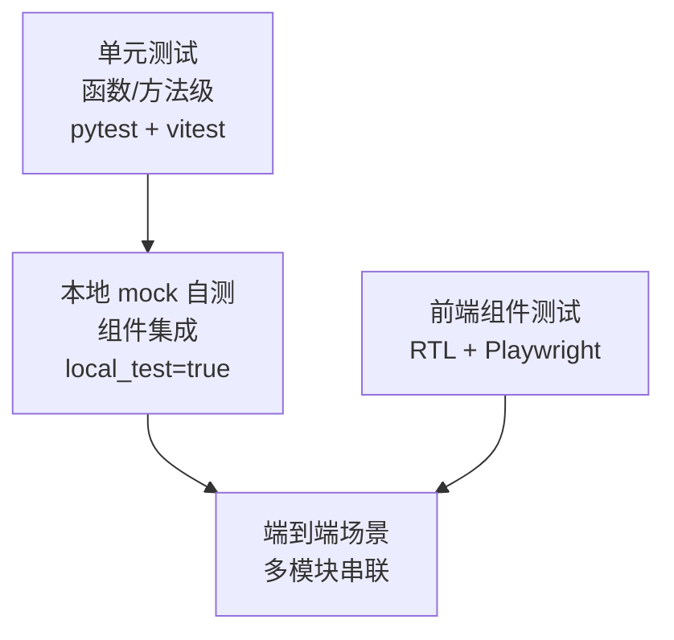

## 定位

本 plan 是 `[实施_plan_函数组件清单_f4bc0d9b.plan.md](/Users/mima1-6/.cursor/plans/实施_plan_函数组件清单_f4bc0d9b.plan.md)` 的伴生测试文档。模块编号沿用实施 plan（M1-M16 + F1-F13）。

按主 plan TDD 原则，每层测试需满足覆盖率三维目标（代码 / 分支 / 功能）；不足 100% 需文档注明原因。

## 测试分层总览

## 一、后端单元测试（按模块）

### T-M1. models/ —— 模型序列化 + 约束

每个模型走 JSON 往返 + validator 覆盖：

**Task 模型**：
- `test_task_required_fields`：缺 title/workspace_path 抛 ValidationError
- `test_task_execution_mode_fixed_to_inherit`：默认值 = `inherit`；传入其他值（fresh_small/fresh_large）一期拒绝
- `test_task_status_enum_closed`：非法 status 拒绝
- `test_task_role_override_optional`：不传时 = None；传时必须 4 角色 key 之一
- `test_task_task_branch_non_empty`：`task_branch` 为空字符串或 None 拒绝（模型要求非空；自动生成在 TaskRegistry 层做，不在模型层）
- `test_task_ppe_lane_optional`：`ppe_lane` 缺省 = None；非空字符串正常
- `test_task_no_max_rounds_field`：反向断言——模型 schema 里没有 `max_design_rounds_req` / `max_design_rounds_arch` 字段（防止旧字段悄悄回潜）

**Repo 模型**：
- `test_repo_hashes_optional_until_cloned`：status=pending/cloning 时 base/init hash 可空；status=ready 时必须非空
- `test_repo_status_transition_pending_cloning_ready`：非法状态跳跃拒绝（例 ready → pending）
- `test_repo_local_path_relative_to_task_workspace`
- `test_repo_task_branch_mirrors_task`：插入 Repo 时 `task_branch` 必须等于对应 Task.task_branch（一期统一分支约束）

**Patch Op 模型**：
- `test_patch_op_kinds_includes_add_repo`：`PatchOpKind` 枚举含 `add_repo`（6 种）
- `test_add_repo_op_required_fields`：`git_url` / `name` / `base_branch` 三字段缺任一抛 ValidationError
- `test_add_repo_op_name_no_slash`：name 不能含 `/`（避免路径注入；一期严格）

**Node 模型**：
- `test_node_kind_req_no_design_content`：REQ/CODE/TEST 含 design_content 抛错
- `test_node_kind_arch_design_content_required`：ARCH 缺 design_content 抛错
- `test_node_arch_no_nesting_validator`：ARCH 父为 ARCH 抛错
- `test_node_leaf_req_no_direct_arch_child`：叶 REQ 直接挂 ARCH 抛错
- `test_node_code_test_parent_must_be_arch`：父为 REQ / CODE / TEST 全拒绝
- `test_node_status_transitions`：各 kind 的合法状态机（见需求 plan 3.1.2）
- `test_node_hints_list_empty_ok`

**NodeHint 模型**：
- `test_hint_category_enum`（background/constraint/code_pointer/deployment/log_access/env_setup/skill_ref）
- `test_hint_weight_enum`（must/should/nice）
- `test_hint_cross_repo_ref_format`：`repo:<name>/<path>` 前缀匹配识别

**Turn 模型**：
- `test_turn_role_enum_closed_4_roles_plus_human`：一期 role ∈ {req_decomposer, req_completeness_critic, arch_designer, arch_coverage_critic, human}
- `test_turn_phase_enum`
- `test_turn_artifacts_serialization`：consumed / produced artifacts 往返

**HitlDecision 模型**：
- `test_hitl_action_4_types`：approve / reject_with_comment / approve_partial / continue_battle 且去掉 converse
- `test_hitl_approve_partial_payload_shape`：approved + rejected 两 key 必填
- `test_hitl_reject_requires_comment`：reject_with_comment 缺 comment 抛错
- `test_hitl_gate_enum`：gate_1 / gate_2

**ProposedPatch**：
- `test_patch_op_kinds`（add_node / modify_node / delete_node / add_edge / remove_edge 五种）
- `test_patch_op_required_fields_per_kind`

### T-M2. NodeGraphStore —— 持久化与约束

（每条测试用临时 sqlite 文件）

**CRUD 基础**：
- `test_store_create_task_persisted`
- `test_store_list_tasks_filter_by_status`
- `test_store_get_task_not_found_raises`
- `test_store_update_task_status_legal_transition`
- `test_store_update_task_status_illegal_rejected`（如 archived → running）
- `test_store_insert_repo_with_task_fk`
- `test_store_update_repo_commits_atomic`
- `test_store_insert_node_basic`
- `test_store_update_node_partial_fields`
- `test_store_insert_edge`
- `test_store_delete_edge`

**硬约束**：
- `test_store_insert_arch_under_arch_rejected`
- `test_store_insert_arch_under_leaf_req_rejected`
- `test_store_insert_code_under_req_rejected`
- `test_store_insert_test_under_code_rejected`
- `test_store_delete_node_pending_allowed`
- `test_store_delete_node_design_pending_allowed`
- `test_store_delete_node_done_rejected`
- `test_store_delete_node_running_rejected`

**查询**：
- `test_store_get_subtree_dfs_order`
- `test_store_query_nodes_by_kind_filter`
- `test_store_query_nodes_by_task_id_isolation`（两 task 同 kind 查询互不干扰）

**Turn 追加专用**：
- `test_store_append_turn_monotonic_ids`
- `test_store_turn_update_not_supported`（尝试 update_turn 不暴露 API）
- `test_store_list_turns_filter_role_phase_combo`

**validate_patch**：
- `test_validate_patch_all_ops_valid`
- `test_validate_patch_add_node_violates_hard_constraint`
- `test_validate_patch_modify_done_node_reported`（返回 requires_hitl=True）
- `test_validate_patch_remove_node_reported`
- `test_validate_patch_remove_edge_reported`
- `test_validate_patch_parent_id_nonexistent_rejected`
- `test_validate_patch_cyclic_edge_rejected`

**apply_patch_atomic**：
- `test_apply_patch_all_success`
- `test_apply_patch_middle_op_fails_rollback_all`（验证全部 op 均未落盘）
- `test_apply_patch_concurrent_task_isolation`（两 task 并发 apply 互不污染）
- `test_apply_patch_transaction_on_db_level`（sqlite savepoint 生效）

**Task 隔离**：
- `test_multi_task_same_node_title_no_conflict`
- `test_multi_task_same_edge_signature_no_conflict`

**运行期插入 Repo**（add_repo 相关）：
- `test_store_insert_repo_after_task_created_allowed`：Task 已存在、运行中，可插入新 Repo 行
- `test_store_insert_repo_duplicate_name_in_task_rejected`：同 task 内 name 冲突抛唯一约束异常
- `test_store_insert_repo_same_name_different_tasks_allowed`：不同 task 允许同名 repo

### T-M3. TaskRegistry

- `test_registry_create_task_no_repos_no_rounds`：mock RepoManager + DispatchFactory，验证：
  - store.create_task 被调一次
  - `repo_mgr.prepare_empty_workspace` 被调一次（而非 `clone_*`）
  - root REQ 节点被 seed
  - DispatchLoop 协程被 spawn
- `test_registry_create_task_autogen_task_branch`：`task_branch=None` → 生成 `orch/<short_id>/<slug>`；验证 slug 规则（lowercase、空格替 `-`、截断长度）
- `test_registry_create_task_explicit_task_branch_preserved`：用户给定的 task_branch 原样落到 Task 行
- `test_registry_create_task_ppe_lane_stored`：ppe_lane 正确落库
- `test_registry_create_task_ppe_lane_none_ok`：不传 ppe_lane 也正常创建
- `test_registry_get_running_loop_active_vs_inactive`
- `test_registry_archive_stops_loop`：已运行的 task archive 后 loop.cancel() 被调用
- `test_registry_list_active_excludes_done_failed_archived`

### T-M4. RepoManager

（fixture：临时 bare git repo 作上游）

- `test_prepare_empty_workspace_creates_dirs`：mkdir `<workspace>` 和 `<workspace>/.orch/`，无任何 git 操作
- `test_prepare_empty_workspace_idempotent`：二次调用不抛异常
- `test_clone_repo_happy_path_creates_subdir`：clone 到 `<workspace>/<name>/`
- `test_clone_repo_uses_branch_checkout_minus_b`：task_branch 成功创建且 HEAD 指向它（从 Task.task_branch 读值）
- `test_clone_repo_empty_commit_created`：init_commit_hash ≠ base_commit_hash
- `test_clone_repo_empty_commit_message_contains_task_metadata`：task_id / repo_added_at / root_requirement 摘要在 commit msg 里
- `test_clone_repo_reuses_prepared_workspace`：先 prepare 再 clone，不重建父目录
- `test_clone_repo_invalid_git_url_raises_and_cleans_subdir`：失败后 `<workspace>/<name>/` 不残留
- `test_clone_repo_nonexistent_base_branch_raises`
- `test_clone_repo_duplicate_name_in_task_rejected`：同 Task 内第二次 clone 同 name 抛异常（由 store 或 RepoManager 预检）
- `test_two_add_repos_produce_independent_clones`：单 Task 内连续两次 add_repo，产出两个独立 Repo 行 + 各自目录
- `test_clone_two_tasks_init_commit_hash_differs`（即使同 git_url 同 base_branch）→ 验证 CKG 隔离前提
- `test_resolve_path_valid_repo_name`
- `test_resolve_path_invalid_name_raises`
- `test_resolve_path_traversal_attack_blocked`（repo_name 含 `..` 拒绝）
- `test_cleanup_removes_entire_workspace_dir`

### T-M5. RoleConfig + RoleAgentRegistry

**RoleConfig 加载**：
- `test_roleconfig_load_4_roles_from_yaml`
- `test_roleconfig_system_prompt_composed_from_preamble_plus_role_md`
- `test_roleconfig_user_override_adapter`
- `test_roleconfig_missing_prompt_file_raises`

**RoleAgentRegistry**：
- `test_registry_get_or_create_session_caches`：同 role 二次请求命中缓存
- `test_registry_session_carries_trajectory_path`
- `test_registry_session_includes_bound_adapter_instance`
- `test_registry_destroy_session_closes_adapter`
- `test_registry_different_tasks_independent`：task A 的 session 不会出现在 task B

### T-M6. PromptComposer

（每条给一个固定 fixture 任务状态 → 验证输出字符串关键片段）

- `test_compose_req_battle_cold_contains_root_requirement`
- `test_compose_req_battle_cold_no_repo_list_yet`：REQ 冷启动时 CLONED_REPOS 段为"尚无"或不出现
- `test_compose_req_battle_critic_feedback_includes_proposer_latest_output`
- `test_compose_arch_battle_cold_contains_full_req_tree`
- `test_compose_arch_battle_cold_does_not_include_code_test_trees`（冷启动时 ARCH 树尚未生成）
- `test_compose_arch_battle_cold_contains_task_branch`：含 `Task.task_branch` 值
- `test_compose_arch_battle_cold_contains_cloned_repos_empty_when_no_repos`：CLONED_REPOS 段显示"尚无"
- `test_compose_arch_battle_cold_contains_cloned_repos_after_add_repo`：有 Repo 行时列表 name/local_path/base_branch
- `test_compose_converse_expands_node_refs`：`@node123` → 完整节点描述替换
- `test_compose_converse_history_last_k_turns_ordered`
- `test_compose_inherit_code_impl_contains_recent_k_design_turns`
- `test_compose_inherit_code_impl_contains_parent_arch_design_content`
- `test_compose_inherit_code_impl_contains_task_branch_and_cloned_repos`
- `test_compose_inherit_code_impl_contains_ppe_lane_when_set`：Task.ppe_lane="gray-1" → prompt 含"PPE 泳道 `gray-1`"
- `test_compose_inherit_code_impl_omits_ppe_lane_when_none`：缺省时不出现
- `test_compose_inherit_test_impl_contains_test_level_hint`
- `test_compose_inherit_test_impl_contains_ppe_lane_when_set`
- `test_compose_impl_verification_contains_all_arch_and_code_test_nodes`
- `test_compose_impl_verification_contains_ppe_lane_when_set`
- `test_compose_gate2_req_revision_flags_triggered_from_gate`
- `test_render_tree_view_status_symbols_correct`：pending / running / done / failed 符号一致
- `test_expand_node_refs_circular_protection`
- `test_recent_k_history_respects_k_bound`（默认 K=5）

### T-M7. PatchProposalExecutor

**parse_xml**：
- `test_parse_valid_xml_yaml_roundtrip`
- `test_parse_missing_proposed_patch_tags_raises`
- `test_parse_malformed_yaml_inside_raises`
- `test_parse_mixed_ops_preserves_order`
- `test_parse_add_repo_op_into_typed_model`：解析 `- op: add_repo` 节为 `AddRepoOp(git_url, name, base_branch)`

**validate_guardrails**（兜底硬守卫 + 权限守卫）：
- `test_guardrail_no_trigger_for_pure_add`
- `test_guardrail_triggers_on_remove_node`
- `test_guardrail_triggers_on_remove_edge`
- `test_guardrail_triggers_on_modify_done_node`
- `test_guardrail_does_not_trigger_on_modify_pending_node`
- `test_guardrail_multiple_ops_any_trigger_flags_whole_patch`
- `test_guardrail_add_repo_allowed_for_arch_designer`：source_turn_role=arch_designer 不触发 reject
- `test_guardrail_add_repo_rejected_for_req_decomposer`
- `test_guardrail_add_repo_rejected_for_req_completeness_critic`
- `test_guardrail_add_repo_rejected_for_arch_coverage_critic`
- `test_guardrail_add_repo_reject_reason_mentions_role_restriction`

**apply**：
- `test_apply_success_writes_summary`
- `test_apply_validation_error_returns_feedback_text`
- `test_apply_atomic_rollback_on_mid_failure`
- `test_apply_error_feedback_text_human_readable`（含 op 序号 + 原因）
- `test_apply_turn_id_recorded_in_summary`
- `test_apply_add_repo_calls_repo_mgr_clone_sync`：MockRepoMgr 验证 clone_repo 被同步调用，agent 本轮 ack 在 clone 返回之后
- `test_apply_add_repo_success_inserts_repo_row`：clone 成功后 store 中出现新 Repo 行（status=ready）
- `test_apply_add_repo_clone_failure_rolls_back_whole_patch`：fake clone 抛异常 → 本 patch 其他 ops 均不生效
- `test_apply_add_repo_clone_failure_emits_validation_error_feedback`：error_feedback 含原因 + 标记 `[VALIDATION_ERROR]`
- `test_apply_add_repo_plus_add_nodes_single_transaction`：add_repo + 随后 add_node 在一条 patch 中都成功；失败也一起回滚

### T-M8. DispatchLoop（用 MockAdapter 脚本化输入）

**REQ battle**：
- `test_req_battle_explicit_converged_marker_exits_early`：critic 第 2 轮输出 `[CONVERGED]` → 立即进 Gate 1
- `test_req_battle_implicit_convergence_same_issue_list_two_rounds`：连续 2 轮 critic 问题列表哈希一致 → 自动进 Gate 1（无 [CONVERGED]）
- `test_req_battle_implicit_convergence_whitespace_normalize`：只有空白差异也触发
- `test_req_battle_different_issues_continues`：每轮问题列表不同 → 继续跑
- `test_req_battle_max_rounds_5_hard_cap`：跑满 5 轮仍未收敛 → 强制进 Gate 1
- `test_req_battle_machine_marker_case_sensitive`：小写 `[converged]` 不触发
- `test_req_battle_no_configurable_rounds`：DispatchLoop 构造签名不接收 max_rounds 参数

**Gate 决策分支**：
- `test_gate_approve_advances`
- `test_gate_reject_with_comment_reopens_battle_with_comment`
- `test_gate_approve_partial_applies_per_node_hints`
- `test_gate_continue_battle_extra_rounds_unchanged`：continue_battle 的 `extra_rounds` 参数仍可传入无上限

**ARCH battle + Gate 2**：
- `test_arch_battle_produces_arch_code_test_tree_full`
- `test_arch_battle_applies_proposed_patches_sequentially`
- `test_arch_battle_max_rounds_5_same_constant`（与 REQ battle 共用 DEFAULT_MAX_ROUNDS）
- `test_arch_battle_add_repo_patch_applied_before_further_design`：arch_designer 第 1 轮同时产出 add_repo + add_node ops；第 2 轮看到 CLONED_REPOS 列表里有新 repo

**inherit 执行流水线**：
- `test_inherit_dispatches_codes_in_order`
- `test_inherit_dispatches_test_before_code_when_tdd_enforced`（verify test_level=unit node 先于 code）
- `test_inherit_node_done_advances_pipeline`
- `test_inherit_node_failed_halts_with_event`

**DESIGN_CHANGE_REQUEST**：
- `test_design_change_request_halts_pipeline`
- `test_design_change_user_approved_resumes_with_marker`
- `test_design_change_user_rejected_passes_comment`

**REQ 回流**：
- `test_req_revision_at_gate2_triggers_arch_designer`
- `test_req_revision_outside_gate2_does_not_trigger`（通过 ReqWatcher 间接测）

**机读标记解析**：
- `test_parse_all_five_markers`（CONVERGED / NODE_DONE / NODE_FAILED / VALIDATION_ERROR / DESIGN_CHANGE_REQUEST）
- `test_parse_marker_case_sensitive`
- `test_parse_marker_in_middle_of_text_detected`

**Converse 排队**：
- `test_converse_enqueued_during_busy_processed_when_idle`
- `test_converse_fifo_order_preserved`

### T-M9. ReqWatcher

- `test_watcher_triggers_on_req_add_during_gate2_waiting`
- `test_watcher_triggers_on_req_modify_during_gate2_waiting`
- `test_watcher_triggers_on_req_delete_during_gate2_waiting`
- `test_watcher_no_trigger_on_arch_modify_during_gate2_waiting`
- `test_watcher_no_trigger_on_req_modify_outside_gate2_waiting`
- `test_watcher_idempotent_multiple_patches_one_trigger`

### T-M10. ConverseQueue

- `test_queue_fifo_order`
- `test_queue_dequeue_blocks_when_empty`
- `test_queue_pending_count_accurate`
- `test_queue_backpressure_warning_above_threshold`

### T-M11. Adapter Protocol + Registry

- `test_protocol_surface_methods_required`：缺任一方法的 fake adapter 类型检查失败
- `test_adapter_capabilities_dataclass_defaults`
- `test_registry_auto_scan_adapters_dir`
- `test_registry_get_by_name`
- `test_registry_list_names_returns_one_for_phase1`（trae + mock，但前端展示可能过滤 mock）
- `test_registry_duplicate_registration_raises`

### T-M12. TraeAgentAdapter

（fixture：`fake_trae.sh` 写入伪 trajectory 文件）

- `test_trae_start_session_does_not_spawn_process`（每轮独立进程设计）
- `test_trae_start_session_records_env_dict`
- `test_trae_send_spawns_subprocess_with_correct_args`
- `test_trae_send_injects_system_prompt_as_prefix`
- `test_trae_send_parses_final_assistant_message`
- `test_trae_send_streams_via_trajectory_tail`
- `test_trae_trajectory_incremental_events_match_stream_callback`
- `test_trae_subprocess_nonzero_exit_raises_adapter_error`
- `test_trae_subprocess_timeout_kills_and_raises`
- `test_trae_concurrent_sessions_independent_trajectory_files`
- `test_trae_capabilities_supports_session_resume_false`
- `test_trae_resolve_artifacts_lists_trajectory_paths`
- `test_trae_send_passes_ppe_lane_env_var_when_session_has_it`：session.env["PPE_LANE"]="gray-1" → fake trae 子进程读到该值
- `test_trae_send_no_ppe_lane_env_when_session_missing`：session.env 无 PPE_LANE → fake trae env 中该键不存在（断言 key not in env）
- `test_trae_adapter_uses_shipped_config_with_playwright_mcp`：不传覆写时 subprocess 命令含 `--config-file=config/trae_default.yaml`；读取该 YAML 断言 `mcp_servers.playwright` 存在 + `allow_mcp_servers` 含 `playwright` + `--user-data-dir` 指向默认路径或 `ORCH_BROWSER_PROFILE_DIR` env 覆写值
- `test_trae_adapter_config_override_user_wins_over_ship`：role_config.trae_config_path=/custom/c.yaml → subprocess 走 custom 而非 ship 默认
- `test_trae_adapter_config_override_workspace_wins_over_ship`：`<workspace>/.orch/trae_config.yaml` 存在 → 走 workspace 版本（优先级在 ship 默认之上、用户覆写之下）
- `test_ensure_playwright_profile_creates_dir`：临时 HOME，profile 不存在 → 调用后目录存在
- `test_ensure_playwright_profile_logs_first_time_hint`：首次运行 → 日志含"请在该 profile 浏览器内登录"引导文案
- `test_ensure_playwright_profile_respects_env_override`：设 `ORCH_BROWSER_PROFILE_DIR=/tmp/foo` → 返回 `/tmp/foo`
- `test_ensure_playwright_profile_idempotent_when_exists`：目录已含 `Default/` 子目录 → 不重复打印引导日志

### T-M13. MockAdapter

- `test_mock_scripted_outputs_consumed_in_order`
- `test_mock_callback_invoked_with_user_message`
- `test_mock_exhausted_scripted_raises_or_loops`（由配置决定）

### T-M14. EventBus + WebSocketConsole

- `test_bus_multiple_subscribers_all_receive`
- `test_bus_task_scoped_isolation`
- `test_bus_unsubscribe_stops_delivery`
- `test_bus_event_types_coverage`：TurnStreamed / PatchApplied / GateWaiting / DesignChangeRequest / NodeFailed / TaskStateChanged 全类型分别触发一次
- `test_ws_console_stream_callback_forwards_to_bus`

### T-M15. FastAPI 路由

（`pytest + httpx.AsyncClient`）

**tasks**：
- `test_post_tasks_creates_with_minimal_fields`：只给 title + root_requirement → 返回 Task（task_branch 自动生成）
- `test_post_tasks_accepts_explicit_task_branch`
- `test_post_tasks_accepts_ppe_lane`
- `test_post_tasks_missing_title_422`
- `test_post_tasks_missing_root_requirement_422`
- `test_post_tasks_rejects_legacy_repos_spec_422`：body 含 `repos_spec` 字段 → 422（因 `extra=forbid`）
- `test_post_tasks_rejects_legacy_max_design_rounds_422`：body 含 `max_design_rounds_req` → 422
- `test_post_tasks_autogen_task_branch_format`：未传 task_branch → 返回体中 task_branch 符合 `^orch/[a-z0-9]+/[a-z0-9-]+$`
- `test_get_tasks_pagination_or_full`
- `test_get_task_id_includes_nodes_edges_recent_turns`
- `test_post_task_archive_stops_loop_and_marks_archived`

**nodes**：
- `test_get_nodes_readonly_endpoint`
- `test_get_node_by_id_includes_hints`

**turns**：
- `test_get_turns_filter_role`
- `test_get_turns_filter_phase`
- `test_get_turns_pagination`

**conversations**：
- `test_post_conversation_enqueues`
- `test_post_conversation_invalid_role_400`
- `test_post_conversation_invalid_node_refs_400`
- `test_get_conversations_returns_turn_history_filtered_by_role`

**hitl**：
- `test_post_hitl_approve_advances_gate`
- `test_post_hitl_reject_with_comment_reopens`
- `test_post_hitl_approve_partial_validates_full_coverage`
- `test_post_hitl_continue_battle_extra_rounds_accepted`
- `test_post_hitl_invalid_gate_400`

**design-change**：
- `test_post_design_change_approve_resumes_agent`
- `test_post_design_change_reject_requires_comment`

**adapters**：
- `test_get_adapters_lists_phase1_set`（trae + mock）

**ws**：
- `test_ws_connect_receives_heartbeat`
- `test_ws_receives_real_events_in_order`
- `test_ws_wrong_task_id_rejected`
- `test_ws_reconnect_gets_missed_events`（若实现重放）

**system / lifespan**：
- `test_lifespan_calls_ensure_playwright_profile`：启动时 `_ensure_playwright_profile()` 被调用一次（monkeypatch 计数）
- `test_get_system_status_includes_playwright_profile_fields`：response body 含 `playwright_profile_dir` + `playwright_profile_bootstrap` 布尔
- `test_get_system_status_bootstrap_true_when_profile_fresh`：首次启动（临时 HOME 无 profile） → `playwright_profile_bootstrap=true`
- `test_get_system_status_bootstrap_false_when_profile_has_default_dir`：预先 mkdir `<profile>/Default` → `playwright_profile_bootstrap=false`

### T-M16. prompts 模板

- `test_preamble_md_exists_and_contains_key_sections`：运行环境 / 节点模型 / patch 格式 / 禁止 / 输出规范 / 克制原则 / source_ref 规范
- `test_role_md_per_role_has_section_anchors`：每个角色文件含"你的角色 / 使命 / 产出 / 质量标准"
- `test_arch_designer_prompt_contains_sdd_tdd_change_sections`：§ SDD / § TDD / § 执行期设计修订规则 / § ARCH 阶段 TEST 骨架产出要求 均出现
- `test_arch_coverage_critic_contains_checklist_section`
- `test_user_message_templates_render_no_undefined_placeholder`：对每个 jinja 模板喂 fixture 渲染 + 无 `{{ }}` 残留
- `test_user_message_templates_include_machine_marker_docs`（让 agent 知道怎么输出标记）

## 二、后端集成测试（跨模块，local_mock 等价）

位于 `backend/tests/integration/`。用 MockAdapter 替换 LLM；真实 NodeGraphStore + 临时 sqlite；真实 RepoManager + 临时 bare git repo。

- `test_integration_task_lifecycle_mock_happy_path`：创建（仅 title + root_req，无 repos）→ REQ battle 两轮 → Gate1 approve → ARCH battle 两轮：第 1 轮 arch_designer 发 `add_repo` op，RepoManager clone 临时 bare repo；第 2 轮含完整 ARCH/CODE/TEST 树 patch → Gate2 approve → inherit 跑完 → done；断言 cloned_repos 在后续 prompt 中正确出现
- `test_integration_task_zero_repo_lifecycle`：arch_designer 全程不发 add_repo（如纯文档任务）→ workspace 目录始终空、任务走完
- `test_integration_add_repo_clone_failure_rollback`：MockAdapter 脚本让 arch_designer 发 add_repo 到不可达 URL → 整批回滚 → 下一轮 user_message 带 `[VALIDATION_ERROR]` → 改正 URL 重试成功
- `test_integration_non_arch_designer_tries_add_repo_blocked`：req_decomposer 脚本产出 add_repo op → PatchExecutor Guardrail 拒绝 → VALIDATION_ERROR 回传；REQ 树无变动
- `test_integration_converse_auto_patch_roundtrip`：对话中 AI 回 `<proposed_patch>` → 自动应用 → 前端事件广播 → NodeGraphStore 有新节点
- `test_integration_patch_rollback_triggers_error_turn`：AI 输出违反硬约束的 patch → 整体回滚 → 下轮 user_message 带 `[VALIDATION_ERROR]` → AI 重改
- `test_integration_design_change_request_flow`：AI 回 `[DESIGN_CHANGE_REQUEST]` → DispatchLoop halt → 前端收到事件 → approve → AI 下一轮输出 patch → 继续
- `test_integration_gate2_req_revision`：Gate2 等待中用户对话改 REQ → ReqWatcher 识别 → arch_designer 续跑 → ARCH 更新
- `test_integration_multi_task_concurrent_no_interference`：同时跑 2 task 各自 add_repo 走完流程；验证节点/Turn/WS 事件严格隔离
- `test_integration_ckg_isolation_empty_commit`：两 task 各自 add_repo 同一 upstream → init_commit_hash 不同 + `.trae-agent/ckg/<hash>.db` 路径不冲突
- `test_integration_hitl_reject_loop`：Gate1 reject → REQ battle 重开 → 再 approve → 正常推进
- `test_integration_battle_implicit_convergence`：critic 连续 2 轮输出同一问题列表 → 自动进 Gate（无需 [CONVERGED]）
- `test_integration_battle_5_round_hard_cap`：critic 5 轮持续产新问题 → 第 5 轮后强制进 Gate
- `test_integration_continue_battle_unbounded`：连续 3 次 continue_battle 每次加 5 轮都执行
- `test_integration_ppe_lane_env_forwarded_to_adapter`：Task.ppe_lane="gray-1" → MockAdapter 记录 send() 收到的 env 含 PPE_LANE=gray-1；实施期 prompt 也含 ppe_lane
- `test_integration_node_failed_redispatch`：CODE failed → halt → redispatch → 第二次 done

## 三、端到端测试（真实 trae，可选）

位于 `backend/tests/e2e/`。标 `@pytest.mark.e2e`，CI 可选跑（需 trae 二进制 + LLM key）。

- `test_e2e_simple_task_one_repo_one_code_node`：真实 trae + 真实 LLM 跑一个极简任务（例如"在 foo.py 中加一个返回 Hello 的函数"）从创建到 done，检查 git diff 是否含该函数
- `test_e2e_task_with_pre_existing_code`：repo 有历史代码，要求 AI 最小修改 → 验证最终 commit 的改动行数在阈值内
- `test_e2e_tdd_flow_test_first_then_code`：要求 AI 按 TDD 做 → 验证 TEST 节点先 done 再 CODE 节点 done
- `test_e2e_converse_guided_refinement`：运行到 Gate2 → 通过对话要求 AI 改 ARCH → 验证 patch 自动应用
- `test_e2e_multi_repo_task`：一个 task 两个 repo 都有改动 → 验证两 repo 各自 task_branch 独立提交
- `test_e2e_ckg_no_collision`：连续跑两次同一 task 模板（不同 task_id）→ trae `.trae-agent/ckg/` 目录下有两个独立 `.db`

## 四、前端测试

### T-F1. api/client + types

（Vitest + msw）

- `client.test.ts`：每个方法调对路径 / 方法 / body
- `client_error_handling.test.ts`：4xx / 5xx 响应正确 throw
- `ws.test.ts`：事件类型正确分发到 handler map
- `ws_reconnect.test.ts`：断线自动重连
- `types.test.ts`：TypeScript 编译期检查（通过 `tsc --noEmit`）

### T-F2. taskStore (Zustand)

- `store_hydrate.test.ts`
- `store_apply_patch_summary_updates_nodes.test.ts`
- `store_append_turn_preserves_order.test.ts`
- `store_set_gate_waiting_blocks_ui.test.ts`
- `store_set_design_change_blocks_ui.test.ts`
- `store_clear_blockers_after_resolution.test.ts`
- `store_event_sequence_replay_idempotent.test.ts`（重复 apply 同一事件结果一致）

### T-F3. useWebSocket hook

- `useWebSocket_connects_on_mount.test.tsx`
- `useWebSocket_disconnects_on_unmount.test.tsx`
- `useWebSocket_dispatches_to_store.test.tsx`

### T-F4. TaskListPage

- `TaskListPage_renders_list.test.tsx`
- `TaskListPage_empty_state.test.tsx`
- `TaskListPage_click_opens_detail.test.tsx`
- `TaskListPage_new_task_button_opens_dialog.test.tsx`

### T-F5. TaskConfigDialog

**保留**：
- `TaskConfigDialog_form_validation_required_fields.test.tsx`：title + root_requirement 必填
- `TaskConfigDialog_adapter_dropdown_phase1_trae_only.test.tsx`
- `TaskConfigDialog_submit_calls_api_client.test.tsx`：提交调 `apiClient.createTask`

**新增**：
- `TaskConfigDialog_task_branch_optional_shows_autogen_placeholder.test.tsx`：未填时 placeholder 含 "自动生成 orch/..."
- `TaskConfigDialog_task_branch_explicit_value_in_payload.test.tsx`
- `TaskConfigDialog_ppe_lane_optional_free_text.test.tsx`
- `TaskConfigDialog_submit_payload_shape_matches_new_api.test.tsx`：payload 只含 { title, root_requirement, task_branch?, ppe_lane?, role_overrides? }；**不含** repos / max_rounds_*
- `TaskConfigDialog_no_repos_subform_rendered.test.tsx`：DOM 里找不到"添加仓库"按钮 / repo 行 input（反向断言）
- `TaskConfigDialog_no_max_rounds_inputs_rendered.test.tsx`：DOM 里找不到 max_rounds 相关输入

**删除**：
- ~~`TaskConfigDialog_at_least_one_repo_required.test.tsx`~~
- ~~`TaskConfigDialog_add_remove_repo_row.test.tsx`~~
- ~~`TaskConfigDialog_max_rounds_number_only.test.tsx`~~

### T-F6. TaskDetailPage（两栏布局）

- `TaskDetailPage_layout_has_top_bar_split_overlay_dialog.test.tsx`：DOM 结构检查
- `TaskDetailPage_left_contains_mindmap.test.tsx`
- `TaskDetailPage_right_contains_roles_tabbar_and_pane.test.tsx`
- `TaskDetailPage_topbar_has_repos_chip_and_full_audit_button.test.tsx`
- `TaskDetailPage_no_bottom_convo_panel.test.tsx`（反向断言，旧 ConversationPanel/RightPanelTabs 容器不再出现）

### T-F6a. SplitPanelLayout

- `SplitPanel_initial_ratio_from_localstorage.test.tsx`
- `SplitPanel_divider_mousedrag_updates_ratio.test.tsx`
- `SplitPanel_ratio_persisted_on_mouseup.test.tsx`
- `SplitPanel_enforces_min_left_320.test.tsx`
- `SplitPanel_enforces_min_right_320.test.tsx`
- `SplitPanel_collapse_left_to_48.test.tsx`
- `SplitPanel_collapse_right_to_48.test.tsx`
- `SplitPanel_collapsed_right_shows_role_icon_rail.test.tsx`
- `SplitPanel_rejects_both_sides_collapsed.test.tsx`
- `SplitPanel_keyboard_arrow_adjusts_ratio.test.tsx`
- `SplitPanel_aria_separator_role.test.tsx`

### T-F7/13. MindmapCanvas + useMindmapLayout

**MindmapCanvas**：
- `MindmapCanvas_renders_nodes_by_kind.test.tsx`
- `MindmapCanvas_readonly_cannot_drag.test.tsx`
- `MindmapCanvas_readonly_cannot_delete.test.tsx`
- `MindmapCanvas_click_fires_onNodeClick.test.tsx`
- `MindmapCanvas_node_status_badge_color.test.tsx`
- `MindmapCanvas_snapshot_golden.test.tsx`

**useMindmapLayout**：
- `useMindmapLayout_single_req_centered.test.ts`
- `useMindmapLayout_deep_tree_stable_coords.test.ts`
- `useMindmapLayout_insert_node_local_reflow_only.test.ts`
- `useMindmapLayout_cycles_rejected.test.ts`

### T-F8. NodeFloatingCard（原 NodeInspector 迁移）

- `NodeFloatingCard_no_render_when_no_click.test.tsx`
- `NodeFloatingCard_renders_on_click_near_node.test.tsx`
- `NodeFloatingCard_req_rendering.test.tsx`
- `NodeFloatingCard_arch_design_content_markdown.test.tsx`
- `NodeFloatingCard_arch_test_plan_section_highlighted.test.tsx`
- `NodeFloatingCard_code_test_hints_rendering.test.tsx`
- `NodeFloatingCard_markdown_xss_escape.test.tsx`
- `NodeFloatingCard_close_button_removes.test.tsx`
- `NodeFloatingCard_pin_toggles_state.test.tsx`
- `NodeFloatingCard_reference_in_chat_appends_chip.test.tsx`
- `NodeFloatingCard_drag_within_container.test.tsx`

### T-F8a. NodeFloatingCardLayer

- `FloatingLayer_unpinned_replaced_on_other_node_click.test.tsx`
- `FloatingLayer_pinned_not_replaced.test.tsx`
- `FloatingLayer_multiple_pinned_coexist.test.tsx`
- `FloatingLayer_esc_closes_unpinned.test.tsx`

### T-F9. RolesTabBar（原 RoleSelector 替换）

- `RolesTabBar_renders_4_role_tabs_phase1.test.tsx`
- `RolesTabBar_plus_slot_disabled_phase1.test.tsx`
- `RolesTabBar_active_highlight.test.tsx`
- `RolesTabBar_click_calls_onChange.test.tsx`
- `RolesTabBar_unread_dot_on_new_turn.test.tsx`
- `RolesTabBar_streaming_dot_animated.test.tsx`
- `RolesTabBar_warning_badge_on_validation_error.test.tsx`
- `RolesTabBar_queued_tab_greyed_with_tooltip.test.tsx`
- `RolesTabBar_keepalive_inactive_tabs_not_unmounted.test.tsx`

### T-F9a. RoleConversationPane

- `RoleConvPane_filters_turns_by_role.test.tsx`
- `RoleConvPane_preserves_scroll_on_tab_switch.test.tsx`
- `RoleConvPane_preserves_draft_per_role.test.tsx`
- `RoleConvPane_draft_persisted_to_localstorage.test.tsx`
- `RoleConvPane_at_mention_opens_picker.test.tsx`
- `RoleConvPane_at_mention_inserts_chip.test.tsx`
- `RoleConvPane_send_calls_api_with_role_from_tab.test.tsx`
- `RoleConvPane_streaming_token_by_token.test.tsx`
- `RoleConvPane_applied_patch_badge_expandable.test.tsx`
- `RoleConvPane_queue_depth_per_role.test.tsx`
- `RoleConvPane_no_patch_checkbox_ui.test.tsx`（反向断言）

### T-F9b. RoleTurnTimeline（原 MessageHistory 改名）

- `RoleTurnTimeline_bubbles_chrono.test.tsx`
- `RoleTurnTimeline_origin_badge_user_red.test.tsx`
- `RoleTurnTimeline_origin_badge_battle_blue.test.tsx`
- `RoleTurnTimeline_origin_badge_converse_purple.test.tsx`
- `RoleTurnTimeline_origin_badge_impl_green.test.tsx`
- `RoleTurnTimeline_origin_badge_system_grey.test.tsx`
- `RoleTurnTimeline_machine_marker_converged.test.tsx`
- `RoleTurnTimeline_machine_marker_node_done.test.tsx`
- `RoleTurnTimeline_machine_marker_validation_error.test.tsx`

### T-F9c. TurnFilterBar

- `TurnFilterBar_default_all_checked.test.tsx`
- `TurnFilterBar_uncheck_battle_hides_battle.test.tsx`
- `TurnFilterBar_uncheck_system_hides_system.test.tsx`
- `TurnFilterBar_filter_persisted_per_role.test.tsx`

### T-F10. GateReviewDialog

- `GateDialog_shows_both_sides_final_verdict.test.tsx`
- `GateDialog_approve_submits.test.tsx`
- `GateDialog_reject_requires_comment.test.tsx`
- `GateDialog_approve_partial_requires_full_tree_coverage.test.tsx`
- `GateDialog_continue_battle_number_input.test.tsx`
- `GateDialog_round_trace_visible.test.tsx`

### T-F11. DesignChangeDialog

- `DesignChangeDialog_shows_agent_rationale.test.tsx`
- `DesignChangeDialog_approve_with_optional_comment.test.tsx`
- `DesignChangeDialog_reject_requires_comment.test.tsx`
- `DesignChangeDialog_submit_clears_blocker.test.tsx`

### T-F12. TurnAuditPanel（内容组件）

- `TurnAuditPanel_lists_turns_reverse_chronological.test.tsx`
- `TurnAuditPanel_role_phase_filters.test.tsx`
- `TurnAuditPanel_expand_shows_artifacts.test.tsx`
- `TurnAuditPanel_virtualized_scroll_1000_rows.test.tsx`

### T-F12a. TurnAuditModal

- `TurnAuditModal_hidden_by_default.test.tsx`
- `TurnAuditModal_opens_on_full_audit_button.test.tsx`
- `TurnAuditModal_closes_on_esc.test.tsx`
- `TurnAuditModal_closes_on_backdrop.test.tsx`
- `TurnAuditModal_closes_on_x.test.tsx`
- `TurnAuditModal_focus_returns_to_trigger.test.tsx`
- `TurnAuditModal_state_preserved_across_open_close.test.tsx`

### T-F12b/F21. ReposPopover（原 RepoListView）

- `ReposPopover_chip_shows_repo_count_zero_initially.test.tsx`
- `ReposPopover_chip_count_increments_on_add_repo.test.tsx`
- `ReposPopover_hidden_by_default.test.tsx`
- `ReposPopover_opens_on_chip_click.test.tsx`
- `ReposPopover_closes_on_esc.test.tsx`
- `ReposPopover_closes_on_outside_click.test.tsx`
- `ReposPopover_empty_state_text.test.tsx`
- `ReposPopover_lists_repos_after_hydration.test.tsx`
- `ReposPopover_appends_row_on_ws_patch_applied.test.tsx`
- `ReposPopover_does_not_change_on_unrelated_patches.test.tsx`
- `ReposPopover_copy_path_button.test.tsx`
- `ReposPopover_init_commit_hash_truncated_to_7.test.tsx`
- `ReposPopover_no_remove_button_phase1.test.tsx`（反向断言）

### T-F24. TurnOriginBadge

- `TurnOriginBadge_renders_each_kind.test.tsx`（user/battle/converse/impl/system 五种配色）

### T-F25. MachineMarkerBadge

- `MachineMarkerBadge_extracts_converged.test.tsx`
- `MachineMarkerBadge_extracts_node_done.test.tsx`
- `MachineMarkerBadge_extracts_node_failed_with_reason.test.tsx`
- `MachineMarkerBadge_extracts_validation_error.test.tsx`
- `MachineMarkerBadge_extracts_design_change_request.test.tsx`
- `MachineMarkerBadge_no_badge_when_none.test.tsx`

### T-F26/F27. TopBar 按钮

- `ReposChipButton_click_toggles_popover.test.tsx`
- `FullAuditButton_click_opens_modal.test.tsx`

### 前端 Playwright E2E（≥ 4 条）

- `task_creation_to_mindmap_visible.spec.ts`
- `conversation_triggers_auto_patch_visible_in_ui.spec.ts`
- `gate_approve_advances_stage.spec.ts`
- `split_panel_and_overlays.spec.ts`：拖 divider、折叠两侧、点节点浮出卡 + 钉住、打开 ReposPopover、打开 TurnAuditModal → 关闭 → 状态不丢

## 五、测试基础设施

位于 `backend/tests/conftest.py` + `tests/fixtures/`。

### 后端 fixtures

- `tmp_sqlite_store` —— 每测试函数独立 sqlite
- `tmp_workspace_root` —— tmpdir 作为 TaskRegistry 的根
- `tmp_upstream_bare_repo` —— 工厂函数，返回临时 bare git repo URL，内含 1-2 个 dummy commit
- `fake_trae_script` —— shell 脚本，根据参数写出伪 trajectory JSON
- `scripted_mock_adapter` —— factory：按列表产出
- `rich_task_fixture` —— 预置一个跑到 Gate 2 的任务状态（含 REQ tree + ARCH tree + CODE/TEST 骨架），让下游测试不用每次跑满流程
- `captured_events` —— EventBus 订阅器收集所有事件便于断言
- `freeze_time` —— 冻结时间便于断言 timestamp

### 前端 fixtures

- `mockApiHandlers.ts`（msw）—— 每个 API endpoint 一个 mock handler
- `mockWsServer.ts`（mock-socket）—— WS 服务端模拟
- `sampleTaskState.ts` —— 典型 task state 快照数据
- `sampleEvents.ts` —— 各类 WS 事件样板

### CI 配置

- `pytest --cov=backend/orch --cov-report=term --cov-fail-under=85`（一期目标 85%；主 plan 要求接近 100%，但测试基础设施本身排除在外）
- 分标签运行：`pytest -m "not e2e"` 默认跑；`pytest -m e2e` 需要 trae 二进制
- 前端：`vitest --coverage` + Playwright 在独立 CI job

### 覆盖率门槛（对齐 TDD 原则）

- 核心域（NodeGraphStore / DispatchLoop / PatchExecutor / RepoManager）：行 ≥ 95% / 分支 ≥ 90%
- Adapter 层：行 ≥ 90% / 分支 ≥ 85%
- API 层：行 ≥ 85% / 分支 ≥ 80%
- 前端核心组件（MindmapCanvas / RoleConversationPane / RolesTabBar / SplitPanelLayout / NodeFloatingCard / GateReviewDialog）：行 ≥ 85%
- 未覆盖部分必须在 `tests/coverage_exceptions.md` 逐条说明

## 六、测试编写顺序（配合 TDD）

按实施 plan 的 W0-W9 分期，每 W 开发前：

1. 先写该 W 所有模块的 unit test 清单（本 plan 对应章节） —— 全部 RED
2. 实现模块代码 —— unit test 逐个 GREEN
3. 写该 W 涉及的 integration test —— 验证跨模块协作 GREEN
4. 覆盖率未达标的补测试或文档化例外
5. 进入下一 W

## 非目标

- 不做压力测试 / 性能基准（一期不关注 QPS）
- 不做安全渗透测试（单机单用户假设）
- 不做跨浏览器兼容矩阵（只保证 Chrome 最新版）
- 不做 snapshot 视觉回归（复杂度高；留二期）